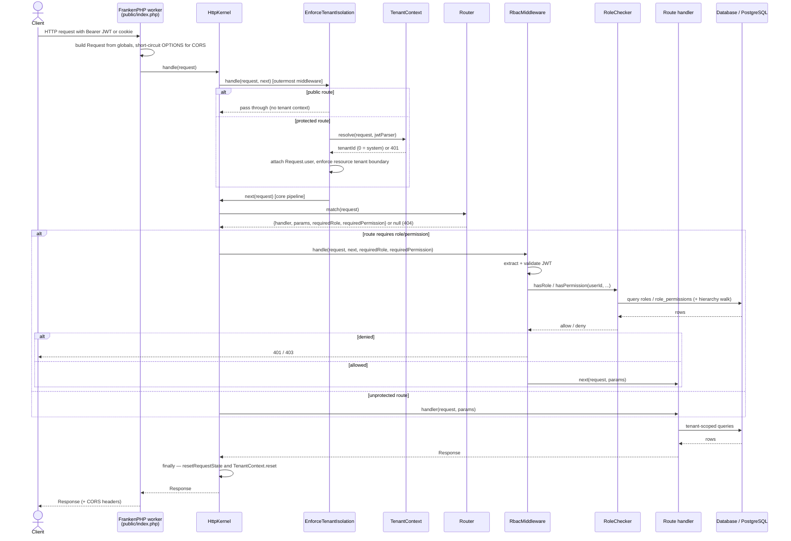
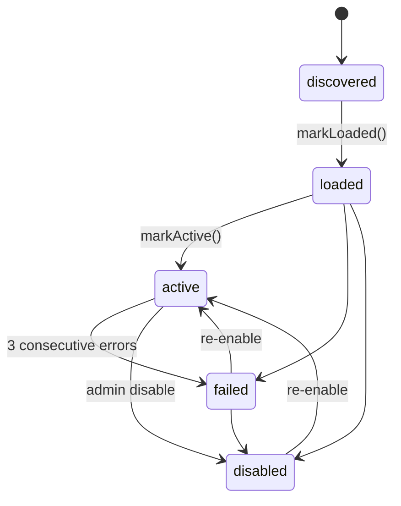
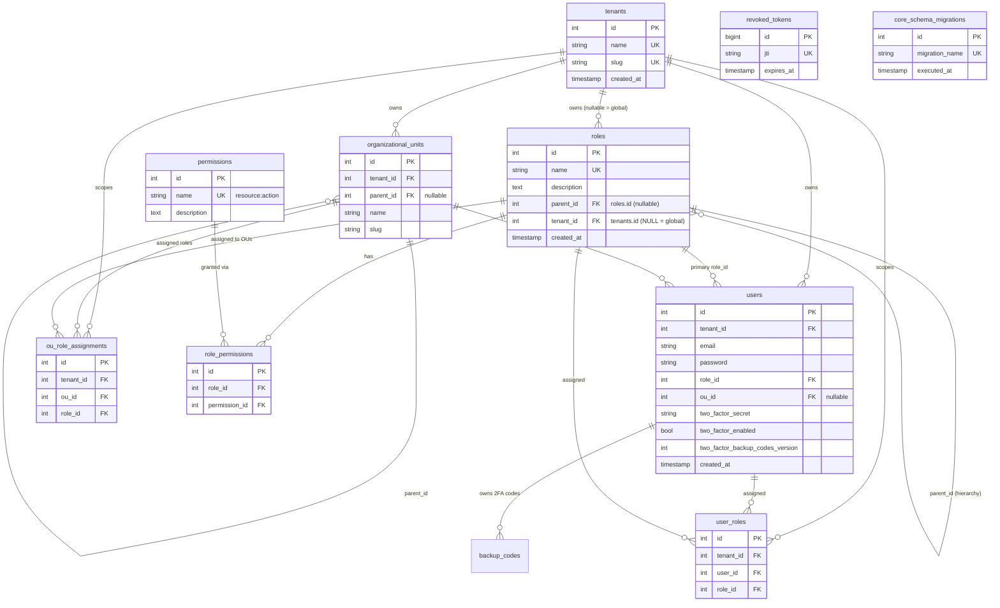
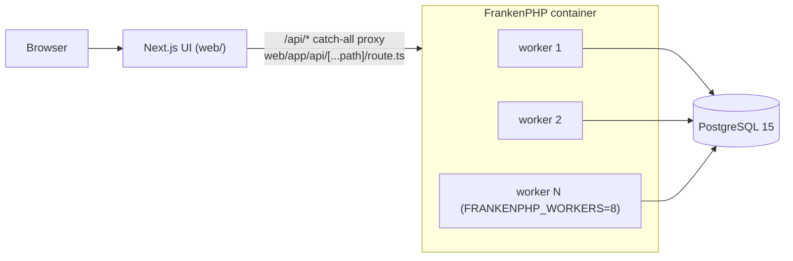

# Architecture

A complete tour of Whity Core for a new backend developer. Read this end-to-end (~30 min) and you should be able to explain the request lifecycle, how plugins load, how RBAC is enforced, and how tenant isolation works. Every claim below is grounded in the current source — file paths are cited so you can read the real code.

For deeper dives, see:

- [PERMISSION_SYSTEM](PERMISSION_SYSTEM.md) — RBAC permissions, registry, role hierarchy.
- [TENANT_ISOLATION](TENANT_ISOLATION.md) — multi-tenancy, `TenantContext`, query scoping.
- [HOOK_SYSTEM](HOOK_SYSTEM.md) — the plugin event/extension mechanism.
- [Plugin-Development](Plugin-Development.md) — how to build a plugin against `PluginInterface`.

## What Whity Core is

Whity Core is a white-labeled, multi-tenant PHP 8.4 platform served by [FrankenPHP](https://frankenphp.dev/) in **persistent worker** mode, backed by a single shared **PostgreSQL** database, with a **Next.js** web UI in `web/`. Tenants share one database; isolation is enforced by a `tenant_id` column on tenant-scoped tables plus a request-scoped tenant context — **not** by per-tenant databases.

The runtime is built from small, explicit components wired together in `public/index.php`:

| Concern | Class | File |
| --- | --- | --- |
| Worker bootstrap + request loop | (script) | `public/index.php` |
| Request dispatch / middleware pipeline | `HttpKernel` | `src/Http/HttpKernel.php` |
| Route matching | `Router` | `src/Core/Router.php` |
| Auth + RBAC enforcement | `RbacMiddleware` | `src/Http/RbacMiddleware.php` |
| Tenant isolation (HTTP layer) | `EnforceTenantIsolation` | `src/Http/Middleware/EnforceTenantIsolation.php` |
| Tenant context (request-scoped) | `TenantContext` | `src/Core/Tenant/TenantContext.php` |
| Query-level tenant scoping | Explicit `tenant_id` predicates in handlers/repositories (proven by `CrossTenantRejectionRealEngineTest`) | `src/Api/`, `src/Core/*/…Repository.php` |
| Connection management | `Database` | `src/Database/Database.php` |
| Permission catalogue | `PermissionRegistry`, `CorePermissions` | `src/Core/RBAC/` |
| Role + permission resolution | `RoleChecker` | `src/Auth/RoleChecker.php` |
| Plugin discovery + lifecycle | `PluginLoader`, `PluginLifecycle`, `PluginState` | `src/Core/` |
| Plugin contract (standalone SDK) | `Whity\Sdk\PluginInterface`, `MigrationInterface`, `Http\Request`/`Response`, `Hooks\Events` — `whity/plugin-sdk` 1.0.0 via composer path repo | `sdk/` |
| Event hooks | `HookManager` | `src/Core/Hooks/HookManager.php` |

## Request lifecycle

### The worker loop

`public/index.php` is both the CLI entry point (commands like `migrate`, `seed`, `generate:openapi`, `revoked-tokens:cleanup`) and the HTTP entry point. When running under FrankenPHP, `function_exists('frankenphp_handle_request')` is true and the script enters a **persistent worker loop**:

1. At boot (once per worker process) it wires up every component: `Database::connect()`, a `Router`, a `JwtParser` (from `JWT_SECRET`), a `TotpService` (from `ENCRYPTION_KEY`), a `PermissionRegistry`, a `HookManager`, a `RoleChecker`, the `RbacMiddleware`, the `EnforceTenantIsolation` middleware, the `HttpKernel`, the `PluginLoader` (then `->load()`), and registers all core API routes.
2. It then loops `for ($nbRequests = 0; !$maxRequests || $nbRequests < $maxRequests; ++$nbRequests)`, calling `frankenphp_handle_request(...)` with a closure that handles one request. `MAX_REQUESTS` (env, default 500 — see `Dockerfile`/`docker-compose.yml`) bounds how many requests a worker serves before FrankenPHP recycles the process.
3. For each request the closure: dispatches the `worker.request.start` hook, builds a `Request` from PHP superglobals (`Request::fromGlobals()`), short-circuits `OPTIONS` preflight with CORS headers, then calls `$kernel->handle($request)`, re-wraps the response with CORS headers, and sends it.
4. In a `finally` block it dispatches `worker.request.end` and calls `TenantContext::reset()` so no tenant state leaks into the next request on the same worker. After each iteration it runs `gc_collect_cycles()`.

There is a non-worker fallback branch (single request) that does the same handling without the loop, for environments without the FrankenPHP runtime.

> Worker model note: because the worker process is long-lived, any static/worker-level state (the `Database` PDO handle, `PermissionRegistry`, `RoleChecker`'s permission cache, `PluginLifecycle` state) survives across requests **by design**, while request-scoped state (`TenantContext`) is explicitly reset between requests by both the kernel and the worker loop.

### The middleware pipeline

`HttpKernel::handle()` (`src/Http/HttpKernel.php`) builds a pipeline. The base of the pipeline is `buildCorePipeline()`, which matches the route and applies RBAC. Registered middleware (added via `$kernel->use(...)`) wrap that core in the order they were registered, because `handle()` iterates `array_reverse($this->middleware)` while nesting — so **the first-registered middleware runs outermost (first)**.

In `public/index.php` only one middleware is registered with `use()`: `EnforceTenantIsolation` (step 8). RBAC is applied *inside* the core pipeline, only for routes that declare a required role/permission. So the effective order for a protected route is:

1. **`EnforceTenantIsolation::handle()`** — resolves the tenant from the JWT (via `TenantContext::resolve()`), attaches the decoded payload as `Request::$user`, and enforces HTTP-level tenant boundaries before any handler/DB work. Public routes (`/api/login`, `/api/login/2fa`, `/api/me`, `/api/auth/refresh`, `/api/auth/logout`) are allowed through untouched. `/api/navigation` is **not** public: WC-175 (#191) made it authenticated and per-caller RBAC-filtered (returning only the items the caller's permissions allow, mirroring `/api/frontend/features`); it returns 401 when unauthenticated.
2. **`Router::match()`** — finds the route for the method + path, extracting `{param}` path parameters and the route's `requiredRole` / `requiredPermission`. No match returns `404`.
3. **`RbacMiddleware::handle()`** — applied by the core pipeline *only when the route declares a `requiredRole` or `requiredPermission`*. It extracts the bearer token (Authorization header or `access_token` cookie), validates the JWT, then checks the role/permission against the authoritative store via `RoleChecker`. A route with neither requirement is fail-open (any authenticated request passes).
4. **Handler** — the matched handler runs as `$handler($request, $params)` and returns a `Response`.
5. **`finally` cleanup** — `HttpKernel::resetRequestState()` resets `TenantContext`, runs registered shutdown functions, resets static properties on core classes, and clears custom globals/superglobals.

> Two layers, one source of truth. The JWT is parsed independently by `EnforceTenantIsolation`/`TenantContext` (for the tenant claim) and by `RbacMiddleware` (for the authorization identity). Both extract the token the same way (Bearer header, then `access_token` cookie). RBAC **never trusts role/permission claims inside the JWT** — it always re-checks against the database via `RoleChecker` (see `src/Http/RbacMiddleware.php` class docblock, issue #54).

### Sequence diagram



## Plugin system

Plugins extend the platform without forking it. The contract is `Whity\Sdk\PluginInterface` (`sdk/src/PluginInterface.php`):

```php
interface PluginInterface
{
    public function getName(): string;          // unique plugin name
    public function getVersion(): string;        // e.g. '1.0.0'
    public function getRoutes(): array;          // [{method, path, handler, requiredRole?}]
    public function getPermissions(): array;     // ['resource:action', ...]
    public function getHooks(): array;           // ['event' => callable | {callback, priority?} | [...]]
    public function getMigrations(): array;      // migration FQCNs
}
```

> Note: this is a *declarative* interface (getters). There are **no** `onEnable()/onDisable()/id()` methods — a plugin declares what it provides and the loader wires it up. See [Plugin-Development](Plugin-Development.md) for a worked example.

### Discovery + reflection loading

`PluginLoader` (`src/Core/PluginLoader.php`) is constructed with the plugins directory and the `Router` (optionally a `PermissionRegistry`, `HookManager`, and PSR-3 logger). On construction it registers a dynamic PSR-4 autoloader. `load()` calls `discover()`, which:

1. Registers a PSR-4 namespace prefix for every direct subdirectory of `plugins/` (directory name → namespace prefix).
2. Optionally trusts a cached `plugin_manifest.json` (when caching is enabled via `enableCache()`), re-validating each cached class still exists and still implements `PluginInterface`.
3. Otherwise scans the directory recursively (`RecursiveDirectoryIterator`), `require_once`s each `.php` file, resolves its FQCN from its path, and uses **reflection** (`ReflectionClass::implementsInterface(PluginInterface::class)`) to confirm it is a real plugin before registering it. Files in a plugin folder that contain no valid plugin class log a warning.

Each discovered plugin is instantiated, and `registerPlugin()` registers its routes (each wrapped in a per-plugin error boundary), permissions (into the `PermissionRegistry`), and hooks (into the `HookManager`), tracking everything so it can later be cleanly unregistered.

### Hot reload (fingerprint + versioned re-eval)

Because a worker is long-lived, `reload()` lets it pick up on-disk changes without a restart. It compares a **fingerprint** of the plugin tree — a map of each `.php` file to a `"mtime:size"` signature (`computeFingerprint()`) — against the snapshot taken at the last load. If nothing changed, it returns `false` cheaply. If files changed, it tears everything down (`unregisterAll()` removes routes via `Router::unregisterByNamespace()` and hooks via `HookManager::removeListener()`, and resets lifecycles) and rebuilds from disk.

A subtlety handled in `materializeClass()`: a PHP class, once defined in a process, **cannot be redefined**. So when a plugin file's content hash changes, the loader rewrites the source's namespace declaration to a content-addressed namespace (`_Whity_Reload_<hash>`) and `eval()`s it, so the *new* code actually runs under a fresh class. Identical content reuses the live class.

### Lifecycle state machine + error isolation

`PluginState` (`src/Core/PluginState.php`) is a string-backed enum: `discovered → loaded → active → failed → disabled` (with `failed/disabled → active` re-enable transitions). `PluginLifecycle` (`src/Core/PluginLifecycle.php`) is one state machine per plugin, holding the current state, a consecutive-error counter, and the last error.



Error isolation lives in `PluginLoader::wrapHandler()` / `wrapHookCallback()`: every plugin route handler and hook callback runs inside a `try/catch`. A throwing handler is logged (with stack trace and `tenant_id`), recorded against the plugin's lifecycle, and returns a safe `500` (`503` if the plugin is already failed) — it can never crash the host or other plugins. After `MAX_CONSECUTIVE_ERRORS` (3) the plugin transitions to `failed` and its handlers short-circuit. A successful invocation resets the counter.

### Plugin management API

`PluginsApiHandler` (`src/Api/PluginsApiHandler.php`) backs the admin plugin routes registered in `public/index.php`:

- `GET /api/plugins` (role `admin`) — list plugins with `name`, `version`, `status`, `routes_count`, `permissions_count` (enriched from the live loader when available, otherwise a filesystem listing).
- `POST /api/plugins/{id}/enable` (role `admin`) — re-enable a runtime-disabled/failed plugin, else enable a `.php.disabled` file on disk.
- `POST /api/plugins/{id}/disable` (role `admin`) — tear down a loaded plugin's routes/hooks and mark it `disabled`, else rename its file to `.php.disabled`.
- `POST /api/plugins/reload` (role `admin`) — returns a success message (plugins hot-load).

> Wiring caveat: in the current `public/index.php`, `PluginsApiHandler` is constructed with only the plugins directory (no live `PluginLoader`), so enable/disable currently use the **filesystem-rename** path rather than the in-memory lifecycle path. The handler also implements a `reEnable()` action, but no `/re-enable` route is registered in `public/index.php`. The code supports the richer in-memory path when a loader is injected.

## RBAC model

Permissions use **`resource:action` colon notation** (e.g. `users:read`, `roles:manage`, `plugins:read`).

### PermissionRegistry + CorePermissions

`PermissionRegistry` (`src/Core/RBAC/PermissionRegistry.php`) is the worker-level catalogue of every permission known to the platform, keyed by source: the literal `core` for built-ins, or the plugin name for plugin permissions.

- `register($source, $permissions)` is the single registration entry point (core and plugins alike). It validates each permission against `^[a-z][a-z0-9_]*:[a-z][a-z0-9_]*$`, throwing `InvalidPermissionException` on a malformed name. The `PluginLoader` calls it inside a per-plugin error boundary, so a plugin declaring a bad permission is logged and skipped rather than crashing the host.
- Core permissions are registered lazily on first read (`ensureCoreRegistered()`), so the RBAC layer can validate them even without explicit bootstrap wiring (issue #55).
- When a plugin is unloaded, its permissions vanish from the registry instantly — no orphaned permission rows.

`CorePermissions` (`src/Core/RBAC/CorePermissions.php`) is the single source of truth for built-ins, registered under the `core` source: `users:read|write|delete`, `roles:read|write|delete|manage`, `tenants:read|write|delete`, `ous:read|write|delete|assign`, `permissions:read`, `plugins:read|enable|disable|upload|uninstall|reload` (WC-218).

### RoleChecker (hierarchy + cache)

`RoleChecker` (`src/Auth/RoleChecker.php`) answers `hasRole($userId, $role, $tenantId)` and `hasPermission($userId, $permission, $tenantId)` against the database. Every check is **tenant scoped** (WC-54): a user's effective grants include roles reached through their organizational unit, which are tenant-bound, so the resolved tenant id (from `TenantContext`) is threaded into every check.

A user's **effective role set** is the UNION of:

1. Their **direct role** (`users.role_id`).
2. Every role assigned to their **organizational unit AND each ancestor OU** — the `organizational_units.parent_id` chain walked up to the root — via `ou_role_assignments`, filtered to the current tenant. A user in a child OU therefore inherits the roles granted to every OU above it; an OU role assigned in another tenant never counts.

`hasRole()` returns true when `$role` is in that effective set. `hasPermission($userId, $permission, $tenantId)` resolution order:

1. The permission **must exist in the registry** — an unregistered permission can never be granted.
2. Otherwise resolve against the user's **effective permission set**: the union, over every effective role, of that role's hierarchy-resolved permissions (`getEffectivePermissionsForRole()` walks up the `roles.parent_id` chain, unioning each role's directly-granted `role_permissions`).

Both the role-hierarchy walk and the OU parent-chain walk are protected by visited-set **cycle detection** and a hard `MAX_HIERARCHY_DEPTH = 64` bound; a cycle or over-deep chain is logged and resolution terminates gracefully. Resolved sets are memoized in two **worker-level static caches** — `$effectivePermissionCache` (per role id; tenant-independent) and `$effectiveUserPermissionCache` (per `userId:tenantId`, because OU membership/assignments are tenant scoped). Both hold derived, non-request data safe to share across the requests a worker serves, and both are invalidated via `RoleChecker::clearCache()`, which `RolesApiHandler` (role/permission writes), `UsersApiHandler` (role/OU-membership changes) and `OusApiHandler` (OU role assign/remove) call after any mutating write.

`RoleChecker` also exposes `getEffectiveRolesForUser($userId, $tenantId)` (the role-name list of the effective set) and `getEffectivePermissionsForUser($userId, $tenantId)` (the resolved permission set `hasPermission()` tests against).

### RbacMiddleware route enforcement

`RbacMiddleware` (`src/Http/RbacMiddleware.php`) enforces the route's `requiredRole` and/or `requiredPermission`. A `403` for a missing permission echoes the offending permission under a `required` key. Routes with neither requirement are unprotected (fail-open). The core platform routes registered in `public/index.php` use the legacy role string `'admin'` as their `requiredRole` (e.g. all `/api/users`, `/api/roles`, `/api/tenants`, `/api/ous`, `/api/plugins`, `/api/deployments`, `/api/migrations`, `/api/admin/stats` endpoints).

### Roles API

`RolesApiHandler` (`src/Api/RolesApiHandler.php`) is full CRUD for roles, tenant-scoped via the nullable `roles.tenant_id` column (migration 018):

- A role with `tenant_id IS NULL` is a **global/system role** visible to all tenants (the seeded `admin` and `user` base roles are global).
- A non-NULL `tenant_id` is a **tenant-owned** custom role, isolated to its owner.
- **Read** (list/get/permissions): a tenant sees `WHERE (r.tenant_id = ? OR r.tenant_id IS NULL)`; the system tenant (id 0) sees every role.
- **Write** (update/delete): a tenant may modify only its *own* roles; global base roles return `404` for a tenant and are manageable only by the system tenant.
- **Create** stamps the new role with the current tenant id.

The permission-assignment contract accepts **either** numeric `permissions.id` values (the web UI sends these from `GET /api/permissions`) **or** `resource:action` name strings, in the same `permissions` array (mixed allowed). Unknown ids/names are dropped, never fabricated, before being linked through the `role_permissions` junction table.

## Multi-tenancy

Three cooperating layers enforce tenant isolation; see [TENANT_ISOLATION](TENANT_ISOLATION.md) for the full treatment.

1. **`TenantContext`** (`src/Core/Tenant/TenantContext.php`) — request-scoped holder of the current tenant id. `resolve($request, $jwtParser)` extracts the JWT (Bearer header or `access_token` cookie), validates it, reads the integer `tenant_id` claim, and **locks** the context (a second `setTenantId()` throws until `reset()`). There is no silent fallback: a missing/invalid token or a non-integer claim throws `TenantResolutionException`. Tenant id **0 is the system tenant** (a valid, settable value distinct from the unresolved `null` state). `setSystemMode()` is a separate, audit-logged bypass reserved for trusted non-request contexts (migrations, admin CLI) — it is never derived from request input. `reset()` clears tenant id, lock, and system mode between requests.
2. **Explicit query predicates** — every handler/repository statement on a tenant-owned table carries a hand-written, parameterised `tenant_id` predicate bound from `TenantContext` (the system tenant follows the platform-wide `if ($tenantId === 0) { unscoped } else { scoped }` convention; roles add `OR tenant_id IS NULL` for global roles). There is **no query-rewriting layer**: WC-161 removed the never-wired `ScopesToTenant` trait after an audit found zero production usage, and the guarantee is instead enforced by tests — `tests/Integration/CrossTenantRejectionRealEngineTest.php` proves cross-tenant read AND write rejection per table against a real SQL engine, and fails if a predicate is dropped.
3. **`EnforceTenantIsolation`** (`src/Http/Middleware/EnforceTenantIsolation.php`) — HTTP-level enforcement that runs before routing/DB. After resolving the tenant it compares it against any tenant the request *addresses* (`/api/tenants/{id}` path, `tenant_id` query param, or `X-Tenant-Id` header). A cross-tenant mismatch is refused with `403` *before* the handler runs — unless the caller has cross-tenant authority (system tenant id 0 or `TenantContext::isSystemMode()`), in which case the bypass is audit-logged.

### Connection pooling

`Database` (`src/Database/Database.php`) is a **worker-scoped** PostgreSQL connection manager (WC-21). Each worker holds **one** lazily-initialised PDO connection reused across every request it serves — so N workers yield exactly N backends, not one-per-request. Reliability features: a throttled `SELECT 1` health-check ping (`DB_PING_INTERVAL`, default 5s) before queries; transparent reconnect-and-retry on a recoverable disconnect (SQLSTATE class `08`, `57P01/02/03`); a max connection lifetime (`DB_MAX_LIFETIME`, default 1800s) that recycles connections to bound server-side resource creep; and `resetSessionState()` (called between requests) which rolls back dangling transactions and runs `DISCARD ALL` so nothing request-specific leaks across the shared connection.

## Database schema

The schema is built by ordered migrations in `database/migrations/` (`001`–`018`), tracked in `core_schema_migrations` (migration 005). Tenant-scoped tables carry a `tenant_id` foreign key; isolation is logical (a column + scoping), not physical (no per-tenant database).

Key tables and the migration that introduces them:

- **`tenants`** (001; `slug` added in 003) — `id`, `name UNIQUE`, `slug UNIQUE`, `created_at`. Migration 011 seeds the **system tenant id 0** plus a `system@whity.local` admin user.
- **`roles`** (001; `description` in 004; `parent_id` self-reference for hierarchy in 017; `tenant_id` in 018) — `id`, `name UNIQUE`, `description`, `parent_id → roles(id) ON DELETE SET NULL`, `tenant_id → tenants(id) ON DELETE CASCADE` (NULL = global role).
- **`users`** (001; `ou_id` in 008; 2FA columns in 014) — `id`, `tenant_id → tenants(id)`, `email`, `password`, `role_id → roles(id)`, `ou_id → organizational_units(id) ON DELETE SET NULL`, `two_factor_secret`, `two_factor_enabled`, `two_factor_backup_codes_version`, `created_at`, `UNIQUE(tenant_id, email)`.
- **`permissions`** (002) — `id`, `name UNIQUE` (`resource:action`), `description`, `created_at`. Seeds were normalized from dot to colon notation in 016.
- **`role_permissions`** (002) — junction `role_id → roles(id)`, `permission_id → permissions(id)`, `UNIQUE(role_id, permission_id)`.
- **`user_roles`** (015) — tenant-scoped many-to-many `user ↔ role` junction (`tenant_id`, `user_id`, `role_id`, all `ON DELETE CASCADE`, `UNIQUE(user_id, role_id)`); complements (does not replace) `users.role_id`.
- **`organizational_units`** (007) — `id`, `tenant_id → tenants(id) ON DELETE CASCADE`, self-referencing `parent_id → organizational_units(id) ON DELETE SET NULL`, `name`, `slug`, `description`, `UNIQUE(tenant_id, name)`, `UNIQUE(tenant_id, slug)`.
- **`ou_role_assignments`** (009) — tenant-scoped junction assigning roles to OUs (`tenant_id`, `ou_id`, `role_id`, all `ON DELETE CASCADE`, `UNIQUE(ou_id, role_id)`).
- **`backup_codes`** (014) — hashed 2FA backup codes (`user_id → users(id) ON DELETE CASCADE`, `code`, `used`, `used_at`, `version`).
- **`revoked_tokens`** (012) — JWT revocation by `jti` (`jti UNIQUE`, `expires_at`).
- **`core_schema_migrations`** (005) — migration tracking (`migration_name UNIQUE`, `executed_at`, `execution_time_ms`).

Migrations 006 (deployment tables), 010 (assign OU permissions to roles), and 013 (add cascading deletes) round out the set.

### ER diagram (core relationships)



## Hook system

`HookManager` (`src/Core/Hooks/HookManager.php`) is a Mediator/Observer mechanism. `listen($event, $callback, $priority = 10)` registers a listener; `dispatch($event, $data)` runs all listeners in priority order (lower first), threading the returned array through each (a filter chain); `dispatchAsync()` queues a payload for background processing. Every dispatch injects a context array `['tenant_id' => TenantContext::getTenantId(), 'timestamp' => time()]`. `removeListener()` supports unsubscription (used by plugin hot-reload). The core app uses hooks for `worker.boot`, `worker.request.start/end`, `navigation.register`, `permission.registered`, and the role lifecycle (`role.creating/created/updated/deleting/deleted`). See [HOOK_SYSTEM](HOOK_SYSTEM.md).

## Deployment topology



- **`docker-compose.yml`** runs two services: `postgres` (`postgres:15-alpine`) and `frankenphp` (built from `Dockerfile`, exposing `8000:80`). Key env vars on the FrankenPHP service: `APP_ENV`, the `DB_*` connection + pooling vars (`DB_HOST`, `DB_PORT`, `DB_CONNECT_TIMEOUT`, `DB_MAX_LIFETIME`, `DB_PING_INTERVAL`), `JWT_SECRET`, `ENCRYPTION_KEY` (AES-256-CBC key for stored TOTP 2FA secrets, WC-95), `FRANKENPHP_WORKERS` (default 8), `FRANKENPHP_TIMEOUT`, and `MAX_REQUESTS` (default 500). Outside `APP_ENV=development`, the app fails fast if `JWT_SECRET` or `ENCRYPTION_KEY` is missing (`public/index.php`, `TotpService::resolveEncryptionKey()`).
- **`Dockerfile`** pins `dunglas/frankenphp:1-php8.4` (intentionally not `:latest`, which had drifted to PHP 8.5), installs `pdo_pgsql`, and sets default `FRANKENPHP_WORKERS=8`, `FRANKENPHP_TIMEOUT=60s`, `MAX_REQUESTS=500`.
- **Next.js frontend** (`web/`) talks to the backend through a server-side **catch-all proxy** at `web/app/api/[...path]/route.ts`. The browser calls relative `/api/*` URLs (so cookies / CORS behave), and the proxy forwards them to `http://localhost:8000/api/*`, attaching cookies and forwarding `Set-Cookie` back. `web/lib/api-client.ts` adds automatic silent token refresh: on a `401` it calls `/api/auth/refresh` and retries once.

## Where to go next

- Build a plugin: [Plugin-Development](Plugin-Development.md).
- Permission internals: [PERMISSION_SYSTEM](PERMISSION_SYSTEM.md).
- Tenant internals: [TENANT_ISOLATION](TENANT_ISOLATION.md).
- Event hooks: [HOOK_SYSTEM](HOOK_SYSTEM.md).
- Install / run locally: [Installation](Installation.md), [Sprint-1-Setup](Sprint-1-Setup.md).
</content>
</invoke>
