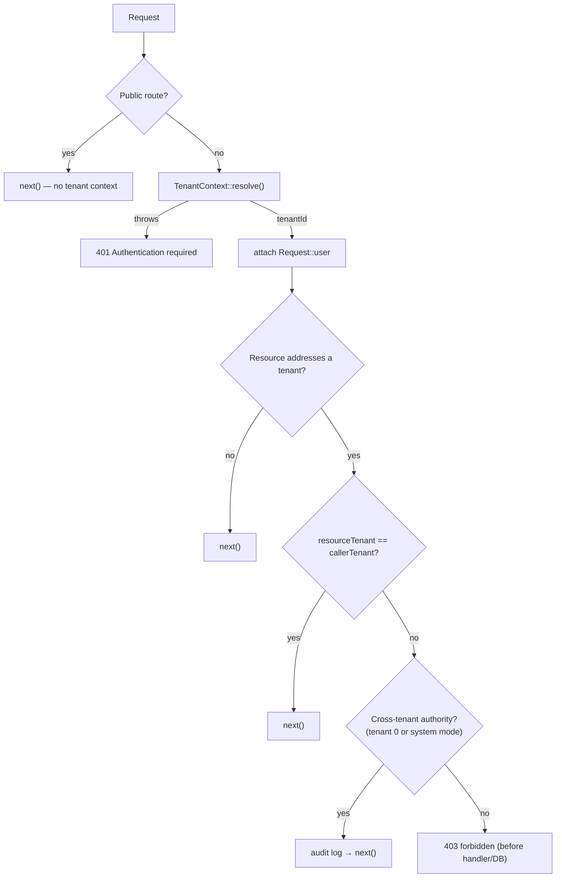
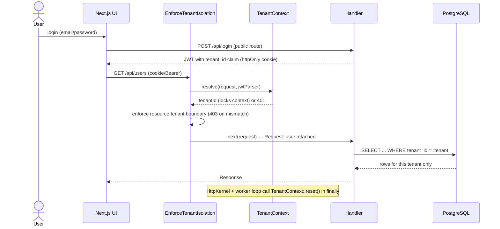

# Tenant Isolation

Whity Core is multi-tenant: many tenants share one PostgreSQL database, and isolation is enforced **logically** by a `tenant_id` column on tenant-scoped tables plus a request-scoped tenant context — there is **no** per-tenant database. Isolation is enforced at three cooperating layers so a single missed check cannot leak data. This page is grounded in the current source.

Related: [Architecture](Architecture.md) · [PERMISSION_SYSTEM](PERMISSION_SYSTEM.md) · [HOOK_SYSTEM](HOOK_SYSTEM.md).

## The three layers

| Layer | Where | What it does | File |
| --- | --- | --- | --- |
| HTTP | Middleware (runs first) | Resolves tenant from JWT; refuses cross-tenant requests before routing/DB. | `src/Http/Middleware/EnforceTenantIsolation.php` |
| Context | Request-scoped static | Holds + locks the current tenant id for the request's lifetime. | `src/Core/Tenant/TenantContext.php` |
| Query | Explicit predicates in handlers/repositories | Every statement on a tenant-owned table binds a `tenant_id` predicate from `TenantContext`; proven per table by a real-engine test suite. | `src/Api/*`, `src/Core/*/…Repository.php`, `tests/Integration/CrossTenantRejectionRealEngineTest.php` |

## TenantContext — the request-scoped holder

`TenantContext` (`src/Core/Tenant/TenantContext.php`) holds the current request's tenant id in static state. Because FrankenPHP workers persist across requests, this static state is the framework's sanctioned exception to the "no request state in statics" rule — and it **must** be reset between requests (it is, by both the kernel and the worker loop).

Tenant ids are **integers**. The special tenant id **0 is the system tenant** — a fully valid, settable value, distinct from the "unset" `null` state. Downstream code (e.g. cross-tenant authority checks) relies on `getTenantId() === 0`.

### Resolving the tenant

```php
public static function resolve(Request $request, JwtParser $jwtParser): int
```

`resolve()` extracts the JWT (`Authorization: Bearer <token>`, falling back to the `access_token` cookie), validates it via `JwtParser`, reads the `tenant_id` claim, coerces a numeric claim to int, and **locks** the context. There is **no silent fallback** — every failure throws `TenantResolutionException`:

- missing token,
- invalid/expired token,
- missing `tenant_id` claim,
- a `tenant_id` claim that is not a valid integer.

### Locking

Once set (via `resolve()` or `setTenantId()`), the context is **locked**. A second `setTenantId()` throws `RuntimeException('TenantContext is locked and cannot be mutated')` until `reset()` is called. This prevents a handler or plugin from changing tenants mid-request and escaping the boundary.

```php
TenantContext::setTenantId(42);
TenantContext::getTenantId();   // 42 (read is always allowed)
TenantContext::setTenantId(99); // RuntimeException: locked
```

### System mode (the trusted bypass)

`setSystemMode(bool $enabled, string $actor, array $context = [])` toggles a tenant-scoping bypass for **trusted, non-request** contexts (migrations, admin CLI). It is **never derived from request input**, and every transition is audit-logged with the actor. `isSystemMode()` reports it. This is separate from "tenant id 0": both grant cross-tenant authority, but system mode is an explicit out-of-band switch.

### Reset between requests

`reset()` clears the tenant id, the lock, and system mode. It is called in the `finally` block of `HttpKernel::handle()` (`resetRequestState()`) and again in the worker loop's `finally` in `public/index.php`, so no tenant or privilege state leaks into the next request on the same worker. (The injected audit logger is intentionally preserved across resets — it is process-scoped infrastructure, not request state.)

## EnforceTenantIsolation — the HTTP layer

`EnforceTenantIsolation` (`src/Http/Middleware/EnforceTenantIsolation.php`) is the first middleware in the pipeline (registered via `$kernel->use(...)` in `public/index.php`). It runs **before** routing, RBAC, and any database access.

`handle(Request $request, callable $next)`:

1. **Public routes** carry no tenant context and pass straight through: `/api/login`, `/api/login/2fa`, `/api/me`, `/api/auth/refresh`, `/api/auth/logout`. `/api/navigation` is **not** among them: WC-175 (#191) made it authenticated and per-caller RBAC-filtered (returning only the items the caller's permissions allow, mirroring `/api/frontend/features`), so it was removed from `PUBLIC_ROUTES` and returns 401 when unauthenticated.
2. Otherwise it delegates token → tenant extraction to `TenantContext::resolve()`. Any `TenantResolutionException` collapses to a generic `401 Authentication required` (internals never leak to the client).
3. It re-parses the (now validated) token to expose the decoded payload as `Request::$user` for downstream handlers.
4. It determines the tenant the request *addresses*, if any (`resolveResourceTenantId()`), in priority order:
   - a `/api/tenants/{id}` path segment,
   - a `tenant_id` query-string parameter,
   - an `X-Tenant-Id` header.
5. Decision:
   - no addressed tenant → defer to the handler and the query-level layer (`next`),
   - addressed tenant **equals** the caller's tenant → allow,
   - addressed tenant **differs** → allow only if the caller has **cross-tenant authority** (tenant id 0 **or** `isSystemMode()`), in which case the bypass is **audit-logged**; otherwise refuse with `403 Access to the requested tenant is forbidden` *before any handler/DB work runs*.



## The query layer — explicit predicates, proven by tests

Every handler/repository statement that runs **after tenant resolution** and touches a tenant-owned table carries an explicit, parameterised `tenant_id` predicate bound from `TenantContext`. **This hand-written predicate IS the query-level isolation mechanism** — there is no automatic query-rewriting layer. (The `ScopesToTenant` trait that previously advertised one was removed by WC-161: a full audit found zero production call sites, its rewriter refused the JOINs most list endpoints need, and it had no concept of the system tenant's cross-tenant visibility. An advertised guarantee that does not run is worse than none.)

One pre-resolution exception is known and tracked: the login path looks a user up by email *before* any tenant context exists (`AuthHandler`), while the schema's `UNIQUE(tenant_id, email)` permits the same email in different tenants — see issue #181 for the cross-tenant login-ambiguity fix.

The conventions every query follows:

```php
// Regular tenant: scoped read/write
$sql = 'SELECT ... FROM users u JOIN roles r ON u.role_id = r.id WHERE u.tenant_id = ?';

// System tenant (id 0): sees across tenants — the platform-wide convention
if ($tenantId === 0) { /* unscoped variant */ } else { /* scoped variant */ }

// Roles: a tenant sees its OWN roles plus GLOBAL (NULL-tenant) roles
'... WHERE r.id = ? AND (r.tenant_id = ? OR r.tenant_id IS NULL)'
```

- The tenant id is **always bound**, never string-interpolated.
- JOINed statements qualify the predicate with the owning table's alias (`u.tenant_id = ?`), so joined rows cannot under-scope it.
- `INSERT`s set `tenant_id` explicitly from the context; cross-tenant `UPDATE`/`DELETE` attempts match zero rows and surface as 404.

**Because the predicates are hand-written, they are enforced by tests rather than by structure:** `tests/Integration/CrossTenantRejectionRealEngineTest.php` drives the real handlers/repositories against a real SQL engine and proves, per tenant-owned table (users, roles, organizational units, audit log, delegations — persons/relations have the same proof in their own real-engine suites): list/read scoping, cross-tenant read rejection, cross-tenant **write** rejection with the row verified untouched, and system-tenant visibility. Dropping a single predicate makes the suite fail. **When you add a tenant-owned table, extend that suite.**

## CI tenant-predicate guard (WC-192)

The runtime tests above prove the predicates that *exist* are correct; the **static guard** proves a predicate was not *forgotten*. `scripts/ci-tenant-predicate-guard.php` (wired as the `Tenant-predicate guard` step in `.github/workflows/automated-tests.yml`, alongside PHPStan and the plugin smoke) scans `src/` and **fails CI** when a `SELECT`/`UPDATE`/`DELETE` touches a tenant-owned table without a `tenant_id` predicate. It turns the platform's #1 risk — cross-tenant data exposure — into a CI-enforced invariant.

The guard is two small classes plus the script:

- **`TenantOwnedTables`** (`src/Core/Tenant/TenantOwnedTables.php`) — the canonical set of tables that carry a `tenant_id` column, derived from the migrations. `TenantOwnedTablesTest` re-derives the set straight from `database/migrations/` and fails if the list drifts, so the guard can never go stale against the schema.
- **`SanctionedGlobalTables`** (`src/Core/Tenant/SanctionedGlobalTables.php`) — the allowlist of intentionally non-tenant tables (`revoked_tokens`, `core_schema_migrations`). The guard never flags these.
- **`TenantPredicateGuard`** (`src/Core/Tenant/TenantPredicateGuard.php`) — the tokenizer-based scanner. For each SQL statement it reassembles the string literals that build it (`.` concatenation, `implode()`-built `SET`/`WHERE`, the `$sql .= '...'` builder pattern, and `{$col}` interpolation), then passes the statement when it binds a `tenant_id` **predicate** (`tenant_id =`/`IN`/`IS …`, including aliased `u.tenant_id = ?` and transitive joins `p.tenant_id = r.tenant_id`), or only touches global tables, or carries an ignore annotation. A `tenant_id` that appears only in a `SELECT`/`INSERT` column list is **not** a predicate. `INSERT` (and `INSERT … ON CONFLICT … DO UPDATE` upserts) is out of scope — it sets `tenant_id` as a value, not a predicate.

> **Tables with no `tenant_id` column** — `role_permissions` (scopes via `roles`) and `backup_codes` (scopes via `users.user_id`) — are deliberately **not** in `TenantOwnedTables`. They are not directly scannable for a `tenant_id` predicate; isolation for them is enforced at the parent join / owning user id, so listing them would only produce false positives on correct `WHERE role_id = ?` / `WHERE user_id = ?` access.

### The ignore annotation

Some unscoped queries are legitimate and intentional: the **system tenant (id 0)** sees across tenants by design, by-PK lookups use globally-unique `SERIAL` ids, login resolves by globally-unique email, and platform-maintenance/seed paths run with no tenant context. The guard does **not** silently pass these — each must be explicitly annotated so the exception is reviewable:

```php
// @tenant-guard-ignore: system-tenant (id 0) sees all tenants; scoped else-branch binds tenant_id
$stmt = $this->db->prepare('SELECT * FROM users WHERE id = ?');
```

Rules:

- Format is `// @tenant-guard-ignore: <reason>`. The **reason is mandatory** — a reason-less annotation does **not** suppress the flag.
- Place it on the statement's own line(s) or on the comment line(s) directly above it.
- Adding one is a deliberate, reviewed decision: it opts a single statement out of the isolation invariant, so the reason must justify *why* the access is safe without a `tenant_id` predicate.

The detection logic (unscoped → flagged; scoped/global/annotated/INSERT → not) is pinned by `tests/Unit/Core/Tenant/TenantPredicateGuardTest.php`, so the guard's teeth cannot regress.

## The system tenant (id 0)

Migration `011_create_system_tenant.php` provisions tenant id **0** ("System") and a `system@whity.local` admin user. A caller resolved to tenant 0 holds cross-tenant authority: `EnforceTenantIsolation` lets it cross tenant boundaries (audited), and `RolesApiHandler` lets it see and manage every tenant's roles. This is the same mechanism trusted tooling uses via `TenantContext::isSystemMode()` — there is no separate super-admin flag.

## End-to-end flow



## Worker-level connection hygiene

Tenant safety also depends on the shared worker connection not carrying state between requests. `Database` (`src/Database/Database.php`) runs `resetSessionState()` between requests, which rolls back any dangling transaction and issues `DISCARD ALL` so temp tables, prepared plans, `SET` values, and advisory locks cannot bleed across tenants on the one connection a worker reuses. See [Architecture](Architecture.md#multi-tenancy) for connection pooling details.

## Summary

- One shared PostgreSQL DB; isolation is a `tenant_id` column + request-scoped context, **not** separate databases.
- `TenantContext` resolves the tenant from the JWT, locks it, and is reset between requests (no silent fallback; tenant 0 = system).
- `EnforceTenantIsolation` resolves + refuses cross-tenant requests at the HTTP layer before routing/DB; public routes bypass it.
- Query-level isolation is the explicit, bound `tenant_id` predicate every handler/repository statement carries (no rewriting layer); `CrossTenantRejectionRealEngineTest` proves read AND write rejection per table on a real engine and fails if a predicate is dropped.
- The WC-192 CI guard (`scripts/ci-tenant-predicate-guard.php`) statically fails the build on any unscoped tenant-owned-table query; sanctioned exceptions (system-tenant branches, by-PK/global-unique lookups, maintenance/seed paths) must carry a reasoned `// @tenant-guard-ignore: <reason>` annotation.
- The system tenant (id 0) and `isSystemMode()` are the audited cross-tenant bypass; `DISCARD ALL` keeps the shared worker connection clean between requests.
</content>
