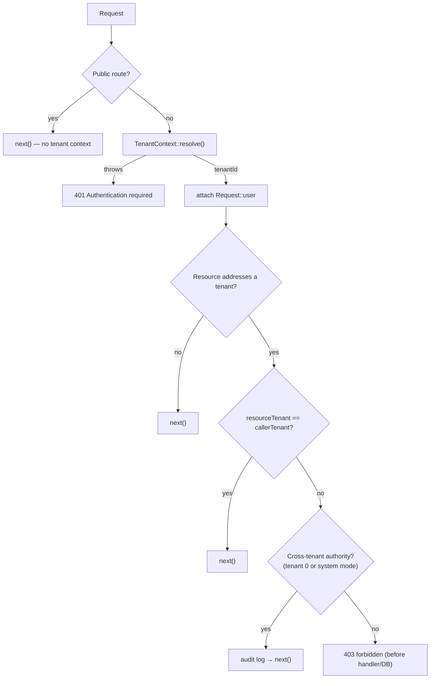
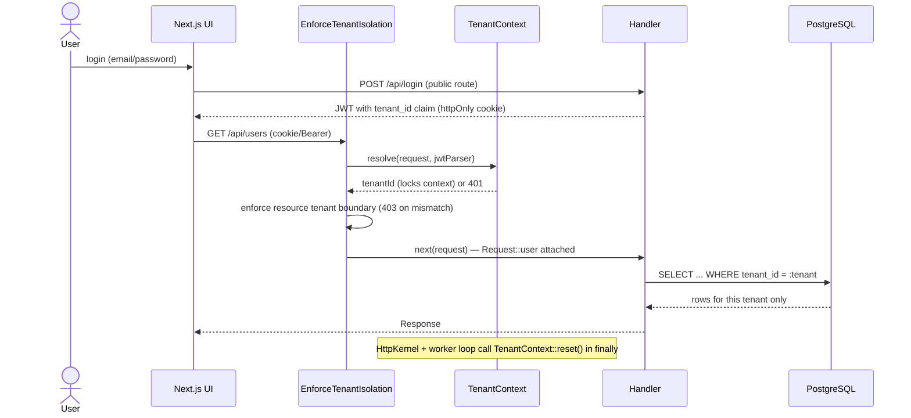

# Tenant Isolation

Whity Core is multi-tenant: many tenants share one PostgreSQL database, and isolation is enforced **logically** by a `tenant_id` column on tenant-scoped tables plus a request-scoped tenant context — there is **no** per-tenant database. Isolation is enforced at three cooperating layers so a single missed check cannot leak data. This page is grounded in the current source.

Related: [Architecture](Architecture.md) · [PERMISSION_SYSTEM](PERMISSION_SYSTEM.md) · [HOOK_SYSTEM](HOOK_SYSTEM.md).

## The three layers

| Layer | Where | What it does | File |
| --- | --- | --- | --- |
| HTTP | Middleware (runs first) | Resolves tenant from JWT; refuses cross-tenant requests before routing/DB. | `src/Http/Middleware/EnforceTenantIsolation.php` |
| Context | Request-scoped static | Holds + locks the current tenant id for the request's lifetime. | `src/Core/Tenant/TenantContext.php` |
| Query | Model/repository trait | Injects a `tenant_id` predicate / auto-populates it; fails closed when unresolved. | `src/Core/Database/ScopesToTenant.php` |

## TenantContext — the request-scoped holder

`TenantContext` (`src/Core/Tenant/TenantContext.php`) holds the current request's tenant id in static state. Because FrankenPHP workers persist across requests, this static state is the framework's sanctioned exception to the "no request state in statics" rule — and it **must** be reset between requests (it is, by both the kernel and the worker loop).

Tenant ids are **integers**. The special tenant id **0 is the system tenant** — a fully valid, settable value, distinct from the "unset" `null` state. Downstream code (e.g. cross-tenant authority checks) relies on `getTenantId() === 0`.

### Resolving the tenant

```php
public static function resolve(Request $request, JwtParser $jwtParser): int
```

`resolve()` extracts the JWT (`Authorization: Bearer <token>`, falling back to the `access_token` cookie), validates it via `JwtParser`, reads the `tenant_id` claim, coerces a numeric claim to int, and **locks** the context. There is **no silent fallback** — every failure throws `TenantResolutionException`:

- missing token,
- invalid/expired token,
- missing `tenant_id` claim,
- a `tenant_id` claim that is not a valid integer.

### Locking

Once set (via `resolve()` or `setTenantId()`), the context is **locked**. A second `setTenantId()` throws `RuntimeException('TenantContext is locked and cannot be mutated')` until `reset()` is called. This prevents a handler or plugin from changing tenants mid-request and escaping the boundary.

```php
TenantContext::setTenantId(42);
TenantContext::getTenantId();   // 42 (read is always allowed)
TenantContext::setTenantId(99); // RuntimeException: locked
```

### System mode (the trusted bypass)

`setSystemMode(bool $enabled, string $actor, array $context = [])` toggles a tenant-scoping bypass for **trusted, non-request** contexts (migrations, admin CLI). It is **never derived from request input**, and every transition is audit-logged with the actor. `isSystemMode()` reports it. This is separate from "tenant id 0": both grant cross-tenant authority, but system mode is an explicit out-of-band switch.

### Reset between requests

`reset()` clears the tenant id, the lock, and system mode. It is called in the `finally` block of `HttpKernel::handle()` (`resetRequestState()`) and again in the worker loop's `finally` in `public/index.php`, so no tenant or privilege state leaks into the next request on the same worker. (The injected audit logger is intentionally preserved across resets — it is process-scoped infrastructure, not request state.)

## EnforceTenantIsolation — the HTTP layer

`EnforceTenantIsolation` (`src/Http/Middleware/EnforceTenantIsolation.php`) is the first middleware in the pipeline (registered via `$kernel->use(...)` in `public/index.php`). It runs **before** routing, RBAC, and any database access.

`handle(Request $request, callable $next)`:

1. **Public routes** carry no tenant context and pass straight through: `/api/login`, `/api/login/2fa`, `/api/me`, `/api/auth/refresh`, `/api/auth/logout`, `/api/navigation`.
2. Otherwise it delegates token → tenant extraction to `TenantContext::resolve()`. Any `TenantResolutionException` collapses to a generic `401 Authentication required` (internals never leak to the client).
3. It re-parses the (now validated) token to expose the decoded payload as `Request::$user` for downstream handlers.
4. It determines the tenant the request *addresses*, if any (`resolveResourceTenantId()`), in priority order:
   - a `/api/tenants/{id}` path segment,
   - a `tenant_id` query-string parameter,
   - an `X-Tenant-Id` header.
5. Decision:
   - no addressed tenant → defer to the handler and the query-level layer (`next`),
   - addressed tenant **equals** the caller's tenant → allow,
   - addressed tenant **differs** → allow only if the caller has **cross-tenant authority** (tenant id 0 **or** `isSystemMode()`), in which case the bypass is **audit-logged**; otherwise refuse with `403 Access to the requested tenant is forbidden` *before any handler/DB work runs*.



## ScopesToTenant — the query layer

`ScopesToTenant` (`src/Core/Database/ScopesToTenant.php`) is a trait a model or repository `use`s to get automatic tenant filtering, so developers don't have to remember to filter every query.

```php
class UserRepository
{
    use ScopesToTenant;

    public function __construct(private \Whity\Database\Database $db) {}

    public function all(): array
    {
        // With TenantContext set to N: SELECT * FROM users WHERE tenant_id = :whity_scope_tenant_id
        return $this->tenantScopedQuery($this->db, 'SELECT * FROM users')->fetchAll();
    }
}
```

`tenantScopedQuery()` / `applyTenantScope()` rewrite SQL according to a strict, fail-closed security model:

- **System mode ON** → the statement runs unchanged (trusted cross-tenant operation).
- **System mode OFF, tenant unresolved (`null`)** → the query is **refused** with `TenantScopeException` (fail closed). Running unscoped would leak every tenant's rows, so it never guesses a default.
- **System mode OFF, tenant resolved** → a `tenant_id` predicate is injected via a **bound parameter** (`:whity_scope_tenant_id`) — the tenant id is **never** string-interpolated into SQL.

Statement handling (`statementType()`):

- **SELECT / UPDATE / DELETE** → `injectWherePredicate()`. An existing `WHERE` is wrapped (`WHERE (<existing>) AND tenant_id = :param`) so operator precedence cannot weaken the filter; otherwise a `WHERE` is inserted before any trailing `GROUP BY/HAVING/ORDER BY/LIMIT/...`. Statements containing a **JOIN** or a **subquery** are refused (an unqualified `tenant_id` predicate would be ambiguous or under-scope them) — write those with an explicit, table-qualified predicate instead.
- **INSERT** → `injectInsertTenant()`. For `INSERT INTO t (cols) VALUES (...)`, if the tenant column isn't already listed it is appended (column + bound param on every tuple). `INSERT ... SELECT`, columnless INSERTs, and `INSERT ... SET` are **refused** rather than silently mis-scoped.

The trait also provides record-level helpers:

- `setTenantIdBeforePersist()` — fills an unset `tenant_id` from the context before save; fails closed if unresolved (system mode leaves it null = system-owned).
- `validateTenantBoundary()` — throws if a record's `tenant_id` differs from the current context (system mode bypasses).
- `bootScopesToTenant()` — a no-op kept so reflection-driven model boot (the WC-7 loader) doesn't break; there is no global query-scope registry, so explicit `tenantScopedQuery()` is the active enforcement path.

> Reality check on core handlers: most core API handlers (e.g. `UsersApiHandler`, `RolesApiHandler`) take a raw `PDO` and write explicit tenant-scoped SQL (e.g. `RolesApiHandler` filters roles by `roles.tenant_id`) rather than using this trait. The trait is the reusable enforcement primitive for model/repository code; the HTTP layer + explicit handler queries are what protect the core endpoints today.

## The system tenant (id 0)

Migration `011_create_system_tenant.php` provisions tenant id **0** ("System") and a `system@whity.local` admin user. A caller resolved to tenant 0 holds cross-tenant authority: `EnforceTenantIsolation` lets it cross tenant boundaries (audited), and `RolesApiHandler` lets it see and manage every tenant's roles. This is the same mechanism trusted tooling uses via `TenantContext::isSystemMode()` — there is no separate super-admin flag.

## End-to-end flow



## Worker-level connection hygiene

Tenant safety also depends on the shared worker connection not carrying state between requests. `Database` (`src/Database/Database.php`) runs `resetSessionState()` between requests, which rolls back any dangling transaction and issues `DISCARD ALL` so temp tables, prepared plans, `SET` values, and advisory locks cannot bleed across tenants on the one connection a worker reuses. See [Architecture](Architecture.md#multi-tenancy) for connection pooling details.

## Summary

- One shared PostgreSQL DB; isolation is a `tenant_id` column + request-scoped context, **not** separate databases.
- `TenantContext` resolves the tenant from the JWT, locks it, and is reset between requests (no silent fallback; tenant 0 = system).
- `EnforceTenantIsolation` resolves + refuses cross-tenant requests at the HTTP layer before routing/DB; public routes bypass it.
- `ScopesToTenant` injects a bound `tenant_id` predicate and fails closed when the tenant is unresolved; unsafe statement shapes are refused, not run unscoped.
- The system tenant (id 0) and `isSystemMode()` are the audited cross-tenant bypass; `DISCARD ALL` keeps the shared worker connection clean between requests.
</content>
