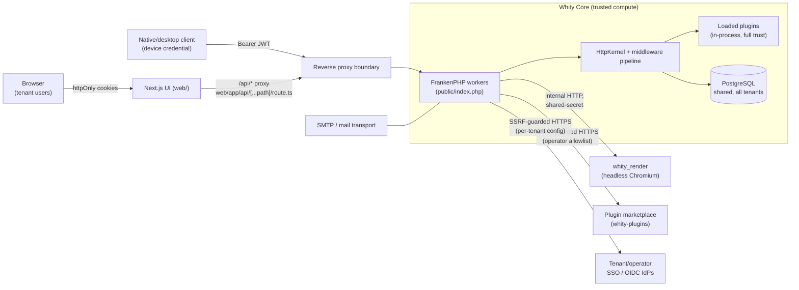

# Threat Model (STRIDE)

A trust-boundary-driven threat model for Whity Core, grounded in the current source — every claim below cites the file that enforces (or fails to enforce) it. Written as part of an adversarial internal security audit (WC-security-audit); see [Pen-Test-Scoping-Brief](Pen-Test-Scoping-Brief.md) for the external-facing companion document (what still needs professional testing, and what this pass already found/fixed).

Related: [Architecture](Architecture.md) · [TENANT_ISOLATION](TENANT_ISOLATION.md) · [PERMISSION_SYSTEM](PERMISSION_SYSTEM.md) · [Plugin-Development](Plugin-Development.md) · [AUDIT_TRAIL](AUDIT_TRAIL.md).

## How to read this document

STRIDE classifies threats by the property they violate: **S**poofing (identity), **T**ampering (integrity), **R**epudiation (non-deniability), **I**nformation disclosure (confidentiality), **D**enial of service (availability), **E**levation of privilege (authorization). Each section below names the trust boundary, the assets it protects, the realistic attackers, and the STRIDE threats that apply — with the actual enforcing code cited, not aspirational controls. Where a control is a documented, *accepted* residual risk (not a bug), it is called out as such rather than silently omitted.

## System overview



**Trusted compute boundary**: everything inside the FrankenPHP worker process — core handlers, repositories, and every loaded plugin — runs as one first-party trust domain with one shared PostgreSQL connection per worker. There is no OS-level sandboxing between core and plugin code (see [Plugin sandbox boundary](#4-the-plugin-boundary-e---elevation-of-privilege-first)). The boundaries that matter are therefore *logical*: the tenant boundary enforced by `TenantContext` + query predicates, the auth boundary enforced by JWT validation + RBAC, and the network boundaries at the edges (browser, render service, marketplace, IdPs).

## Assets

| Asset | Why it matters | Primary control |
| --- | --- | --- |
| Tenant business data (users, documents, notifications, taxonomy, …) | Confidentiality/integrity across ~35 tenant-owned tables in one shared DB | `TenantContext` + per-query `tenant_id` predicate ([TENANT_ISOLATION](TENANT_ISOLATION.md)) |
| Identity/credentials (`profiles.password_hash`, TOTP secrets, backup codes) | Account takeover if disclosed or forged | bcrypt hashing, AES-256 authenticated encryption at rest, single-use backup codes |
| Session material (JWT access/refresh, `token_epoch`, `revoked_tokens`) | Impersonation if forged or replayed | HS256 HMAC signing, per-token + per-profile revocation ([Auth boundary](#3-the-authsession-boundary)) |
| Admin approval queues (password-reset, 2FA-recovery) | Account-takeover-adjacent — approving one clears a second factor or applies a password | `permission_delegations`-style RBAC gate + re-verified tenant membership JOIN at approve/reject time |
| Plugin marketplace packages | Supply-chain: a malicious package runs as fully-trusted core code once installed | SSRF-guarded fetch + host allowlist + `PluginInstaller` validation (signing is **not yet implemented** — see residual risks) |
| Rendered documents (PDF via `whity_render`) | Tenant content confidentiality; render service is a second compute surface | Shared-secret auth, no public exposure, size/time bounds |
| Audit log | Forensic record of security-relevant events | `AuditLogger`, append-only, `audit_log` is itself tenant-owned |

## Attackers considered

| Actor | Capability | Example goal |
| --- | --- | --- |
| Anonymous internet attacker | No credentials; can reach every public route | Enumerate accounts, brute-force login/2FA, forge tokens, SSRF via any operator-configurable URL field |
| Authenticated user, tenant A | Valid JWT for one ordinary tenant/role | Read/modify tenant B's data (IDOR), escalate role within own tenant |
| Malicious/compromised tenant admin | Full admin rights *within their own tenant* | Escalate to system-tenant authority, pivot to other tenants via a shared surface (marketplace, SSO config, render service) |
| Malicious plugin author | Can get a package installed (self-hosted store, or a mis-scoped `plugins:upload` grant) | Full host compromise — see [Plugin boundary](#4-the-plugin-boundary-e---elevation-of-privilege-first) |
| Network-position attacker (MITM, compromised proxy, shared network) | Can observe/replay traffic that isn't protected by TLS end-to-end, or intercept a displayed/typed code | TOTP replay, cookie theft if TLS is misconfigured at the edge |
| Operator/insider with deploy access | Can set environment variables, read secrets at rest | Weak secrets, disabled guards — this is why secret-strength is *enforced in code*, not left to operational discipline alone |

---

## 1. The tenant boundary (I / T — the platform's #1 risk)

**Assets**: every tenant-owned row in the shared PostgreSQL database (~35 tables — see [TENANT_ISOLATION](TENANT_ISOLATION.md#the-query-layer--explicit-predicates-proven-by-tests) for the full, current list in `src/Core/Tenant/TenantOwnedTables.php`).

**Boundary**: `TenantContext` (request-scoped, JWT-derived, locked-after-set) + `EnforceTenantIsolation` (HTTP-layer refusal before any handler/DB work) + a hand-written `tenant_id` predicate on every tenant-owned-table query, proven by `tests/Integration/CrossTenantRejectionRealEngineTest.php` and statically enforced by `scripts/ci-tenant-predicate-guard.php`.

- **Information disclosure**: a caller reads another tenant's rows. Blocked at three layers (HTTP declared-target gate, query predicate, CI static guard) — see the re-verification below.
- **Tampering**: a caller writes/deletes another tenant's rows. The same predicate applies to `UPDATE`/`DELETE`; a cross-tenant write matches zero rows and surfaces as 404, verified by the same real-engine suite (WC-161/190/191).
- **Elevation of privilege**: a caller declares a *different* tenant via the `X-Tenant-Id` header / `tenant_id` query / `/api/tenants/{id}` path and expects the server to honor it. This is the **declared-target boundary** (WC-193): these three signals are read in exactly one place, feed exactly one consumer (the cross-tenant gate), and can only ever *match the caller's own JWT tenant or be refused* — never widen access. Fail-closed parsing (`ctype_digit()`/`(\d+)`) means a crafted value (`-1`, `2.0`, `0x2`, `2; DROP`) resolves to *no declared target* rather than a coercible one.
- **Spoofing** (of tenant identity): would require forging the JWT's `tenant_id`/`active_tenant_id` claim — covered under the [auth boundary](#3-the-authsession-boundary) (HMAC signature + hard-pinned algorithm).

### Re-verification of the 2026-07-20 investigation

The prior investigation (2026-07-20, Tasker task `9516c095`) audited all 21 then-current tenant-owned tables against migrations, the CI predicate scanner, and the real-engine rejection suite, concluding **no live cross-tenant leak** (one test-coverage gap found and closed in PR #573).

Since then, seven feature phases landed and each added tables. This audit re-derived `TenantOwnedTables::all()` and `SanctionedGlobalTables::all()` from the current migrations and re-ran the full triad (registry + `scripts/ci-tenant-predicate-guard.php` + `CrossTenantRejectionRealEngineTest`-style real-engine proof, plus the newer per-feature real-engine suites) to confirm the conclusion still holds:

| Phase / feature | New tenant-owned tables | Isolation mechanism verified |
| --- | --- | --- |
| Document/label designer (WC-docdesigner) | `document_templates`, `document_blocks` | `findById($id, $tenantId)` binds both id AND tenant_id in the repository (`src/Core/Document/DocumentTemplateRepository.php`) — a cross-tenant id returns `null` → 404, never leaks existence. RBAC row-filtering (`DocumentAccessPolicy`) is layered on top, not instead of, this. |
| Feature flags / settings audit | (no new tenant table; `tenant_settings` pre-existing) | `SettingsService` reads tenant overrides scoped by `tenant_id`; global defaults live in the sanctioned-global `app_settings`. |
| Admin-enforced 2FA policy (WC-525) | `two_factor_policies` | Every query binds `tenant_id`; a policy can never leak across tenants. |
| Native taxonomy/tagging (WC-621) | `tag_groups`, `tags`, `entity_tags` | All three carry `tenant_id NOT NULL`; `entity_tags.tenant_id` is denormalized from the tag's tenant so the predicate and the reverse-lookup index sit on one row. |
| Durable job queue + event spine (WC-queue, #154) | `jobs`, `domain_events`, `event_outbox` | Each row carries the enqueuing tenant's id, restored into `TenantContext` before its handler runs; the queue/relay *mechanics* (reserve/complete/reclaim) run as audited system infra across tenants, annotated `@tenant-guard-ignore` with a stated reason in `JobRepository`/`DomainEventStore` — not a silent gap. |
| Scheduler (#a934420e) | `scheduled_jobs` | Tenant-scoped CRUD binds `tenant_id`; the cron tick claims due rows across tenants (same annotated system-infra pattern as the queue) and stamps each enqueue with the row's origin tenant. |
| Notifications (#d89dcc2c / #c56a6455 / #2aa3411a / #d70c6083) | `notifications`, `notification_deliveries`, `user_notification_preferences`, `notification_templates`, `tenant_notification_settings` | `NotificationRepository` binds `tenant_id` **and** `recipient_profile_id` together on per-recipient reads (`src/Core/Notification/NotificationRepository.php`), so even a same-tenant user cannot read another user's notification by guessing its id. `notification_templates` uses the tenant-0-is-global convention (mirrors base roles). |
| Password-reset / 2FA-recovery (WC-password-reset-2fa-recovery) | *(none — intentionally global, see below)* | See next subsection. |

**Password-reset / 2FA-recovery — the intentionally-global tables, re-verified.** `password_resets` and `two_factor_recovery_requests` carry **no `tenant_id` column** by design (they key on the global `profiles` identity anchor, ADR 0005 — a credential belongs to a person, not a tenant) and are correctly enumerated in `src/Core/Tenant/SanctionedGlobalTables.php`. The admin approval **queue** for each is tenant-scoped **at query time via a JOIN to `memberships`**, not via a column on the table itself. This audit read the actual queries in `src/Core/Identity/PasswordResetService.php` and `src/Core/Identity/TwoFactorRecoveryService.php` and confirmed, for every one of `listPendingForTenant()`, `approveForTenant()`, and `rejectForTenant()`:

```sql
-- approveForTenant(): the lookup itself re-verifies membership — a request id
-- from a profile with NO active membership in the caller's tenant matches zero rows.
SELECT pr.id, pr.profile_id, pr.staged_password_hash, pe.email
FROM password_resets pr
JOIN memberships m ON m.profile_id = pr.profile_id AND m.tenant_id = :tenant_id AND m.status = 'active'
...
WHERE pr.id = :id AND pr.status = 'awaiting_approval'
```

Crucially, this membership check is re-run on **every** state-changing call (not just on the initial list), including `rejectForTenant()`'s `UPDATE ... WHERE id = :id AND status = '...' AND EXISTS (SELECT 1 FROM memberships ...)` — so a tenant-A admin cannot approve/reject a request id belonging to a tenant-B-only profile even by guessing/enumerating ids directly against the approve/reject endpoints, bypassing the list. This was verified by code reading (the query text above) and by the existing real-engine test suites for these services; see [IDOR testing](#2-authzidor--rbac-gated-resources-by-id) below for the dynamic attempt.

**Conclusion: the tenant-isolation invariant still holds.** No drift found. The registry/scanner/test triad correctly tracks every table added since 2026-07-20, and the two intentionally-global tables from the newest feature (password-reset/2FA-recovery) use the same JOIN-to-`memberships` re-verification pattern already established for the registrations approval queue, checked on every mutating call, not just at list time.

## 2. Authz/IDOR — RBAC-gated resources by id

**Boundary**: `RbacMiddleware` (route-declared `requiredRole`/`requiredPermission`, re-checked against the DB via `RoleChecker` — the JWT's own role/permission claims are never trusted) + handler-level ownership checks that bind the resource id together with the caller's tenant/profile id in the same query.

Handlers spot-checked (code review; several also exercised as real-engine tests in this repo, see below):

| Handler | Ownership binding | Cross-tenant/cross-user id manipulation result |
| --- | --- | --- |
| `DocumentTemplatesApiHandler` / `DocumentBlocksApiHandler` | `findById($id, $tenantId)` | 404 (row not found for that tenant) — verified in `tests/Api/DocumentTemplatesApiHandlerRealEngineTest.php` / `DocumentBlocksApiHandlerRealEngineTest.php` |
| `PasswordResetApprovalsApiHandler` / `TwoFactorRecoveryApprovalsApiHandler` | JOIN to `memberships` on every approve/reject, re-checked per call (not cached from the list) | `null` return → generic 404 (`'No pending ... request found for that id'`) |
| `NotificationRepository` (via its API handlers) | `tenant_id` **and** `recipient_profile_id` bound together | A same-tenant user presenting another user's notification id gets no row |
| `RolesApiHandler` | `(tenant_id = ? OR tenant_id IS NULL)` on read; owner-only on write | A regular tenant gets 404 modifying a global base role or another tenant's custom role — only the system tenant (id 0) can |
| `OusApiHandler`, `UsersApiHandler` | tenant-bound lookups (`WHERE ... AND tenant_id = ?`) | Same 404-on-mismatch pattern |

No handler in this sample resolves a resource by bare id and defers tenant/ownership scoping to a *later* check (the classic IDOR shape — "fetch first, authorize second, and the fetch already leaked existence via timing/error-shape"). The consistent pattern across the codebase is to bind the id **and** the scoping predicate in the **same** query, so an out-of-scope id simply never matches a row — a 404, not a 403, which also avoids confirming the id's existence to an unauthorized caller.

**Dynamic verification**: the full `tests/Integration/CrossTenantRejectionRealEngineTest.php` and per-feature real-engine suites (document templates/blocks, notifications, roles, OUs, users, password-reset/2FA-recovery) were re-run against a real PostgreSQL engine as part of this audit (see the [pen-test brief](Pen-Test-Scoping-Brief.md) for the exact commands) — all pass, proving read AND write rejection, not just read.

On top of the test suite, this audit also ran a **live HTTP attack** against a throwaway instance (own PostgreSQL + FrankenPHP containers, network-isolated from the shared staging stack): seeded a second tenant ("Tenant B") and a `document_templates` row owned by it, then, authenticated as Tenant A's admin, attempted to read it by id —

```
GET /api/v1/document-templates/5           (Tenant A admin's own valid cookie)
→ 404 {"error":"Template not found"}

GET /api/v1/document-templates/5           (same cookie, PLUS X-Tenant-Id: 2)
→ 403 {"error":"Access to the requested tenant is forbidden"}
```

— i.e. the query-layer predicate silently returns nothing (never confirms the row's existence to the wrong tenant), and separately, the classic "trick the header-based tenant selector" attempt is refused by `EnforceTenantIsolation` before the handler even runs. Both match the code-level analysis exactly.

## 3. The auth/session boundary

**Assets**: the ability to authenticate as a given profile in a given tenant.

### Spoofing — token forgery

`JwtParser` (`src/Auth/JwtParser.php`) wraps `firebase/php-jwt` and decodes with `new Key($this->secret, 'HS256')` — the algorithm is **hard-pinned to the key's own algorithm**, not read from the attacker-controlled `alg` header. This closes both classic JWT attacks:

- **`alg: none`**: rejected — `firebase/php-jwt` only accepts `none` when the caller explicitly passes it in an allowed-algorithms list, which this code never does.
- **Algorithm confusion (HS256 signed with the server's *public* RS256 key, or vice-versa)**: not applicable — the server only ever issues and expects HS256, and `Key($secret, 'HS256')` fixes both the key material and the algorithm together, so a token claiming `alg: RS256` (or any algorithm other than HS256) fails verification rather than being verified against the wrong key interpretation.

The federated (OIDC) path is a **separate, correctly-scoped** verification: `JwtParser::verifyExternalIdToken()` uses `JWK::parseKeySet($jwks, 'RS256')` — asymmetric-only, keyed by the token's `kid` header against the *provider's* published JWKS — and additionally checks `iss`, `aud`, and `nonce`. The two paths never share a key or an algorithm allowance, so a token minted for one cannot be replayed against the other.

**Dynamic check performed**: against the same throwaway live instance, crafted three forged tokens — `alg: none` with an empty signature segment, `alg: none` with a junk trailing segment, and a validly-shaped `alg: HS256` token signed with an attacker-chosen 32-character secret (simulating an attacker who knows the scheme but not `JWT_SECRET`) — each carrying an admin-role payload for the seeded admin profile, and sent every one as a `Bearer` token against `GET /api/v1/users` (an admin-only route). All three came back `401`, identical to sending no token at all. No alg-confusion or none-alg bypass found.

### Tampering / Repudiation — revocation and session integrity

- **Per-token revocation**: `revoked_tokens` (sanctioned global; a `jti` is unique platform-wide) — checked on every access/refresh/device/MCP token validation (`TokenValidator::isTokenRevoked()`).
- **Per-profile epoch**: `profiles.token_epoch`, bumped on password change (self-service and admin-approved paths both bump it — see `PasswordResetService`) and 2FA disable/clear. A bump invalidates **every** outstanding token for that profile across every device/tenant membership in one write, closing the classic "attacker already has a token, victim changes password, attacker's session should die" gap.
- **Membership gate**: `ActiveTenantMembershipGuard` requires an *active* membership in the token's declared tenant (or system-tenant authority) on every validation — a token for a tenant the profile has since been removed from stops working immediately, not just at next login.

### TOTP replay — CONFIRMED and fixed by this audit

`TotpService::validateCode()` (the only production call site was `AuthHandler::handle2fa()`) verified a submitted TOTP code against the current time window but recorded **no state about which step had already been accepted**. Because a TOTP code is valid for its entire ~30-second period regardless of how many independent requests check it, presenting the **same** valid code twice completed **two separate logins** — a textbook TOTP replay (the exact weakness RFC 6238 tells implementers to guard against). This was reproduced two ways before writing the fix:

- A real-engine regression test (`tests/Integration/TotpReplayRealEngineTest.php`): the first `handle2fa()` call with a valid code returned 200; an immediate second call with the **identical** code also returned 200.
- Live, against the throwaway HTTP instance: enrolled 2FA on the seeded admin account, logged in to get a temp token, generated a real TOTP code for the exact same period, and posted it to `/api/v1/login/2fa` twice with the **same** temp token and **same** code. Before the fix, both requests returned `200` (two independent sessions minted from one captured code). After applying the fix, the first request still returns `200`; the immediate replay now returns `401 {"error":"Invalid 2FA code"}`, while a **later, unconsumed** code for the account still authenticates normally — confirmed live, not only in the test suite.

**Fix** (this audit, TDD): migration `080_add_two_factor_last_used_step_to_profiles.php` adds `profiles.two_factor_last_used_step`. `AuthHandler::consumeTotpStep()` atomically advances it (`UPDATE ... WHERE two_factor_last_used_step IS NULL OR < :step`) — the same single-use-burn pattern `BackupCodesService::validateCode()` already used for backup codes, applied here to TOTP time-steps, and race-safe under concurrent workers for the same reason (the `WHERE` guard means only one concurrent request can flip the row). A later, unconsumed step still authenticates normally — the fix stops **replay**, not legitimate subsequent logins. See the [pen-test brief](Pen-Test-Scoping-Brief.md) for severity/fix details.

### Rate-limiting / brute-force

- **Login**: `LoginThrottleService` — independent per-user and per-IP fixed-window counters (defaults 10/900s and 20/900s), checked before password verification.
- **2FA step**: the same throttle is keyed on the temp-token's `profile_id` and checked before code validation in `handle2fa()`.
- **Backup codes**: single-use, atomically burned (`UPDATE ... WHERE used = false`) — a code cannot be spent twice even under concurrent requests, and (per the fix above) TOTP codes now share that same single-use guarantee.
- **Password-reset request**: `PasswordResetHandler::forgot()` — per-email (5/hour) and per-IP (20/hour) fixed windows, counted *before* any lookup so the throttle behaves identically whether or not the address exists (no enumeration).

## 4. The plugin boundary (E — elevation of privilege, first)

**This is the platform's most permissive trust boundary, and it is *not* a sandbox.** A "loaded plugin" is ordinary PHP, `require_once`'d and instantiated by reflection (`PluginLoader::discover()`/`materializeClass()`, `src/Core/PluginLoader.php`) in the **same OS process, same FrankenPHP worker, same PHP memory space** as core code. There is no seccomp/gVisor/separate-process isolation, no restricted `open_basedir`, no capped filesystem/network egress at the language level. Concretely, any plugin route handler or hook callback can:

- **Access the live database connection** — `\Whity\app(Database::class)` (`src/helpers.php`) resolves the *exact same* worker-scoped `Database` instance every core handler uses, via a process-global service container with no per-caller restriction. A plugin can run arbitrary SQL, bypassing every repository-layer `tenant_id` predicate entirely.
- **Manipulate `TenantContext` directly** — `setTenantId()`, `reset()`, and `setSystemMode()` are `public static` methods (`src/Core/Tenant/TenantContext.php`) with no caller-identity check; they are protected only by convention (the framework calling them at defined lifecycle points), not by access control. A plugin could call `TenantContext::reset()` then `setTenantId(0)` (or `setSystemMode(true, 'anything')`) to acquire cross-tenant authority for the remainder of the request.
- **Make unrestricted outbound network calls** — nothing prevents a plugin from opening its own sockets/`curl`/`file_get_contents` to anywhere, including internal-only hosts (the SSRF guards on [HttpFetcher](#5-external-network-boundaries) protect *core-initiated* fetches with *admin-configured* URLs; they do not — and structurally cannot — constrain arbitrary plugin code).
- **Read process environment** — `$_ENV`, including `JWT_SECRET`/`ENCRYPTION_KEY`/`RENDER_SHARED_SECRET`/DB credentials, is ordinary PHP superglobal state visible to any code in the process.

What **does** exist is *error* isolation, not *security* isolation: `PluginLoader::wrapHandler()`/`wrapHookCallback()` catches `\Throwable` around every plugin entry point so a crashing plugin degrades to a `500`/`503` and trips its own lifecycle (`failed` after 3 consecutive errors) without taking down the host or other plugins (`src/Core/PluginState.php`, `src/Core/PluginLifecycle.php`). Permission registration is validated (`PermissionRegistry::register()` rejects a malformed permission name) but nothing stops a plugin from simply calling privileged core APIs directly rather than going through the permission it declared.

**This is an accepted architectural reality, not a bug** — no code or documentation prior to this audit claimed plugins were sandboxed, so there is nothing to "fix" here without a genuine sandboxing feature (separate process/runtime, capability-scoped DB handles, egress allowlisting), which is a substantial undertaking out of scope for this pass. The actual, and currently the **only**, control on this boundary is **what gets installed**:

- **Manual upload** (`PluginsApiHandler`, `plugins:upload` permission) — `PluginInstaller` validates zip-slip/zip-bomb, a filesystem-safe name allowlist, and runs isolated introspection before committing.
- **Marketplace install** (`InstallFromStoreApiHandler`) — gated by the `plugins.store_enabled` master switch (WC-feature-flags-audit) plus an **exact-host allowlist** (`plugins.store_allowed_hosts`, empty by default = feature off) as the primary SSRF control, with `HttpFetcher`'s public-IP-only guard as documented defense-in-depth (its own docblock names the DNS-rebind TOCTOU as an accepted limitation given the URL is operator-configured, not arbitrary user input).
- **What is *not yet* in place**: package **signing/provenance verification** (tracked separately, per project status, as a pending marketplace PR) — today, install-time validation checks that a package is *well-formed and safe to unzip*, not that it came from a trusted publisher. Until signing lands, "what gets installed" is only as trustworthy as the allowlisted store host and whoever can reach `plugins:upload`/store-admin permissions.

**Recommendation for the external pen-test**: attempt an actual malicious-plugin load against a throwaway instance (a route handler that calls `TenantContext::reset()`/`setTenantId()` and reads another tenant's rows, or one that exfiltrates `$_ENV`) to convert this static analysis into a live proof, and treat plugin-install permission grants (`plugins:upload`, marketplace admin) as equivalent to full host compromise when scoping who may hold them.

## 5. External network boundaries

| Boundary | Direction | Guard | Residual risk (accepted / documented) |
| --- | --- | --- | --- |
| Browser ↔ Next.js ↔ core API | Inbound | httpOnly cookies, CORS allowlist (`src/Http/Cors.php` — origin reflected only when it matches `CORS_ALLOWED_ORIGINS`, never a wildcard with credentials), `X-Requested-With` CSRF guard (see below) | The Next.js proxy (`web/app/api/[...path]/route.ts`) forwards upstream redirects by default; OAuth/SSO redirect routes must opt into `redirect: 'manual'` (documented gotcha, not itself a vulnerability in the audited routes) |
| Core → tenant/operator SSO IdPs | Outbound (server-initiated) | `HttpFetcher` SSRF guard (https-only, public-IP-only resolution, no redirects, TLS verified) + PKCE + `iss`/`aud`/`nonce` validation on the returned ID token (`OidcEngine`) | DNS-rebind TOCTOU between the guard's resolution and the fetch's own resolution — documented in `HttpFetcher`'s docblock as an accepted limitation given the target is admin-configured, not attacker-supplied |
| Core → plugin marketplace | Outbound (server-initiated) | Master switch + exact-host allowlist (primary) + `HttpFetcher` guard (defense-in-depth); fetched bytes never trusted (`PluginInstaller`'s full validation pipeline) | Same DNS-rebind caveat as above; **no package signing yet** (see [plugin boundary](#4-the-plugin-boundary-e---elevation-of-privilege-first)) |
| Core → `whity_render` (headless Chromium) | Outbound (server-initiated, internal-only) | Shared-secret header (`X-Render-Secret`, constant-time comparison, ≥32 chars enforced on *both* sides), no public exposure, size/time bounds, own rate limiter | `RenderServiceClient` deliberately applies **no** SSRF/public-IP guard — by design, since the target is the operator-configured, internal-network `RENDER_SERVICE_URL`, not user input; this is the correct trust level for a same-compose-network internal service, not an oversight |
| MCP clients (AI principals) | Inbound | Separate token type (`type: 'mcp'`, `aud: 'mcp'`), registered-jti check against `mcp_tokens` (defeats a validly-signed-but-never-issued token), membership guard, epoch check skipped by design (revocation is explicit via `DELETE /api/mcp/tokens/{jti}`) | Standard token-scope review recommended for the external pen-test — see the scoping brief |

### CSRF

State-changing (`POST`/`PUT`/`PATCH`/`DELETE`) requests that authenticate **ambiently** via a cookie (`access_token`/`refresh_token`/`temp_auth_token`) — or that hit an always-sensitive auth endpoint (`login`, `login/2fa`, `refresh`, `logout`, `select-tenant`, `switch-tenant`) even without a cookie — must carry `X-Requested-With: XMLHttpRequest` (`CsrfGuard`, `src/Http/Middleware/CsrfGuard.php`). This is **enforced server-side**, not merely a client-side convention: a cross-site HTML form cannot set a custom header, and a cross-origin `fetch`/XHR that tries to triggers a CORS preflight the strict origin allowlist refuses for any non-allowlisted origin. A Bearer-only request (no cookie) is exempt because it carries no ambient, browser-attached credential a cross-site attacker could ride. The public, unauthenticated endpoints this audit reviewed (`PasswordResetHandler`, `EmailVerificationHandler`, `TwoFactorRecoveryHandler`) are correctly **not** in the always-protected list: they carry no session cookie to ride, so classic CSRF (riding a victim's ambient credential) does not apply to them — the risk there is enumeration/abuse, which is handled by the rate-limiting and generic-response conventions described above, not CSRF tokens.

**Live confirmation**: a cookie-authenticated `POST /api/v1/auth/logout` sent **without** `X-Requested-With` against the throwaway instance returned `403 {"error":"Cross-site request rejected"}` — the same request with the header succeeds. Separately, an `OPTIONS` preflight carrying `Origin: https://evil.example.com` against an admin route came back with no `Access-Control-Allow-Origin` (and no credentials header) at all — the origin is silently dropped rather than reflected, matching `Cors::headers()`'s allowlist-only behavior.

## 6. Denial of service

- **Global rate limiting**: platform/IP/tenant/principal-tier fixed windows (`RateLimitMiddleware`, env-tunable, `RATE_LIMIT_ENABLED=0` kill switch for emergencies).
- **Body size cap**: `MAX_REQUEST_BODY_BYTES` (default 1 MiB) rejected before parsing (`RequestBodyValidator`).
- **Worker recycling**: `MAX_REQUESTS` bounds how many requests a FrankenPHP worker serves before recycling, limiting the blast radius of a slow memory leak.
- **Render service**: its own `express-rate-limit` window (each render drives a full headless-Chromium page load — expensive), plus a 50 MiB PDF read cap on the client side (`RenderServiceClient::$maxBytes`).
- **Plugin error isolation**: 3 consecutive errors trips a plugin to `failed` and short-circuits further invocations, bounding the cost of a plugin stuck in a crash loop.

## 7. Secrets management

Three operator-supplied secrets share a documented "≥32 chars outside development" convention: `JWT_SECRET`, `ENCRYPTION_KEY`, `RENDER_SHARED_SECRET`.

| Secret | Enforced? | Notes |
| --- | --- | --- |
| `JWT_SECRET` | Yes — `JwtSecretGuard::assertValid()`, boot-time fail-fast outside development | Pre-existing |
| `RENDER_SHARED_SECRET` | Yes — checked on **both** sides (`RenderServiceClient::isConfigured()` and `render-service/src/server.js`'s `isAuthorized()`, constant-time comparison) | Pre-existing |
| `ENCRYPTION_KEY` | **Was NOT enforced — found and fixed by this audit.** Only an *empty* key was rejected; a short-but-present key (e.g. `"abc"`) passed, even though `.env.example` already documented "must be >= 32 chars ... outside APP_ENV=development" | New `EncryptionKeyGuard` (mirrors `JwtSecretGuard`), wired into both consumers: `TotpService::resolveEncryptionKey()` (2FA secrets) and `EncryptedSecretStore::fromEnv()` (IdP client secrets, OAuth/webhook tokens, mail-provider credentials) — these two had silently diverged (only the former was ever guarded at all) |

`.gitignore` correctly excludes `.env`/`.env.local`/`.env.staging` (real secrets) while keeping `.env.staging.example` committed; a repo-wide grep for hardcoded credential-shaped literals in `src/`/`config`/compose files found none — every compose file (including the staging ones) requires secrets via `${VAR:?must be set}`, never a baked-in value.

**Live confirmation**: booted a throwaway FrankenPHP instance with `APP_ENV=production` and `ENCRYPTION_KEY=too-short` — the worker refused to start at all (`frankenphp app module: ... too many consecutive failures: worker ... has not reached frankenphp_handle_request()`), with the container log showing the exact new guard firing: `Uncaught RuntimeException: ENCRYPTION_KEY must be at least 32 characters in non-development environments in .../EncryptionKeyGuard.php:55`. Before this fix, the identical configuration would have booted successfully and silently encrypted every stored TOTP secret under a trivially brute-forceable passphrase.

**Lower-confidence observation (not fixed, flagged for the external pen-test / operator hygiene)**: `.env.example`/`docker-compose.yml` ship well-known placeholder values (`dev_secret_key_change_in_production`, `dev_encryption_key_change_in_production`) that happen to be ≥32 characters — long enough to pass the strength guards above. An operator who copies the example file into a real deployment **verbatim** would pass every automated check while using a publicly-known secret. This is a generic "don't ship real config from an example file" operational risk common to most frameworks with example env files (Rails, Django, etc. have the identical shape of risk), not a defect in the guards themselves; recommended follow-up (not implemented here, to keep this pass's fix scoped to the concrete enforcement gap) is a deploy-time check that rejects the specific known example-secret literals.

## Summary — confirmed findings from this audit pass

| # | Finding | STRIDE | Severity | Status |
| --- | --- | --- | --- | --- |
| 1 | TOTP codes were replayable within their validity window (no anti-replay floor) | Spoofing / Elevation of Privilege | Medium | **Fixed** — migration 080 + `AuthHandler::consumeTotpStep()`, TDD real-engine regression test |
| 2 | `ENCRYPTION_KEY`'s documented ≥32-char convention was never enforced in code | Information Disclosure (weak encryption at rest) | Medium | **Fixed** — `EncryptionKeyGuard`, wired into both consumers |
| 3 | Plugin execution has no runtime sandbox — full trust once loaded | Elevation of Privilege | Informational / architectural (accepted, now explicitly documented) | Not a code fix in this pass; documented as the top item for the external pen-test |
| 4 | Known committed example secrets are long enough to pass strength guards if copied verbatim into production | Information Disclosure | Low (operational hygiene) | Not fixed — flagged as lower-confidence observation |

Everything else checked in this pass (tenant isolation across all tables including new ones, JWT alg-pinning, CORS/CSRF enforcement, IDOR spot-checks, backup-code single-use, generic-error convention, parameterized queries) held up under adversarial review with no exploitable gap found. See the [Pen-Test-Scoping-Brief](Pen-Test-Scoping-Brief.md) for what was and wasn't dynamically exercised, and what still warrants independent professional testing.
