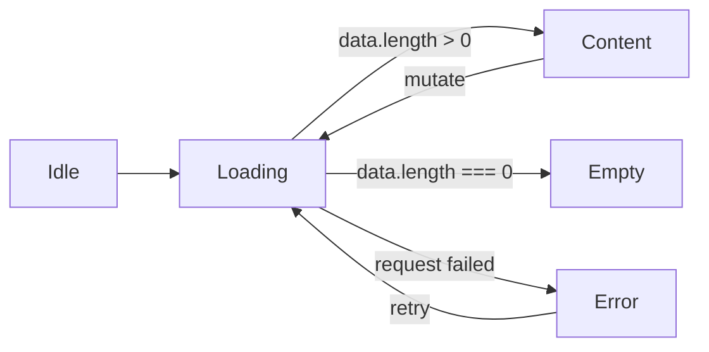

# UI Pattern Guidelines

Canonical patterns for the four cross-cutting UI states every data-driven screen needs:
**loading**, **error**, **empty**, and **form validation**. Each pattern names the **real
components** to reach for, the **design tokens** that should drive the styling, and points at
**actual examples in `web/app/**`**. Where the current code deviates from the token system,
that is called out as a [Follow-up](#follow-ups) rather than silently endorsed.

- **Components:** see [Component-Library](Component-Library.md).
- **Tokens:** reference by role/name from `base.json` / `globals.css`; never hard-code colors.
- **Icons:** `@tabler/icons-react` (see [Design-System-Grid](Design-System-Grid.md)).

## State lifecycle

Most list/detail screens move through the same states. Render exactly one at a time:



The admin list pages already follow this: a single `isLoading` flag, then either the table
(content), the table's empty state, or a toast on failure — see
`web/app/(protected)/admin/users/page.tsx` and `web/components/admin/data-table.tsx`.

---

## Loading

**Goal:** Communicate that work is in progress without layout shift or false "empty" flashes.

### When to use what

| Situation | Pattern | Component |
|-----------|---------|-----------|
| Whole list/table loading | Centered **spinner** in a sized container | `DataTable` (built-in `isLoading`) |
| In-button (submit in flight) | **Disable + label swap** | `Button` (`disabled`, `"Saving…"`) |
| Content placeholders (preferred for known layouts) | **Skeleton** blocks | shadcn `skeleton` *(not yet installed)* |

### Table loading (the shipped pattern)

`DataTable` renders a centered spinner + "Loading…" inside a fixed-height container when
`isLoading` is `true`, so the surrounding layout does not jump:

```tsx
// web/app/(protected)/admin/users/page.tsx
<DataTable columns={columns} data={users} rowActions={rowActions} isLoading={isLoading} />
```

```tsx
// web/components/admin/data-table.tsx (loading branch)
<div className="h-64 flex items-center justify-center …">
  <div className="animate-spin rounded-full h-8 w-8 border-b-2 border-primary …" />
  <p className="text-sm …">Loading…</p>
</div>
```

The spinner ring already uses `border-primary` (token-driven). The container chrome
(`bg-slate-50`, `text-slate-600`, `border-slate-200`) uses raw palette classes — it should use
`bg-muted` / `text-muted-foreground` / `border-border`. See [Follow-ups](#follow-ups).

### In-button loading

There is no `loading` prop on `Button`; the app disables the button and swaps the label:

```tsx
<Button type="submit" disabled={isSubmitting}>
  {isSubmitting ? "Saving…" : "Save Changes"}
</Button>
```

### Recommended: skeletons for structured content

For content with a known shape (cards, stat tiles, table rows), prefer **skeletons** over a
bare spinner — they preserve layout and feel faster. Install the shadcn `skeleton` component
(`npx shadcn@latest add skeleton`) and style it with `bg-muted` + `animate-pulse`:

```tsx
// Skeleton row placeholder (token-driven)
<div className="h-7 w-full animate-pulse rounded-md bg-muted" />
```

> [!NOTE]
> `skeleton` is referenced in the Shadcn-UI-Setup catalog but is **not installed** in
> `web/components/ui/`. Adding it is a follow-up for the component owner.

**Tokens:** spinner accent → `primary` (or `accent`); skeleton fill → `muted`; helper text →
`muted-foreground`; container → `card`/`muted` + `border`.

---

## Error

**Goal:** Tell the user what failed and how to recover, at the right altitude.

### Three altitudes

| Altitude | Use when | Component | Tokens |
|----------|----------|-----------|--------|
| **Toast** (transient) | Result of a user action (save/delete/fetch failed) | `useToast().addToast(msg, "error")` + `ToastContainer` | error styling (should be `destructive`) |
| **Inline** (persistent, in-flow) | A specific section/region failed; user should see it until resolved | `Alert variant="destructive"` | `destructive`, `card` |
| **Field-level** | A single form field is invalid | `FormMessage` | `destructive` (see [Validation](#form-validation)) |
| **Page-level** | The whole route can't render (auth, fatal fetch) | full-bleed `Alert`/empty layout + retry, or a route error boundary | `destructive`, `muted-foreground` |

### Toast errors (the shipped pattern)

Every admin mutation funnels failures through a toast. The message is extracted from the API
response when available, then surfaced:

```tsx
// web/app/(protected)/admin/users/edit-modal.tsx
try {
  const response = await apiClient(`/api/users/${user.id}`, { method: "PATCH", body: … });
  if (!response.ok) {
    const errorData = await response.json().catch(() => ({}));
    throw new Error(errorData.error || errorData.message || "Failed to update user");
  }
  addToast("User updated successfully", "success");
  onSuccess();
} catch (error) {
  addToast(error instanceof Error ? error.message : "Failed to update user", "error");
}
```

**Conventions:**
- Always provide a human fallback message (`"Failed to update user"`); never surface a raw
  `[object Object]` or empty string.
- Parse `errorData.error || errorData.message` from the API envelope before falling back.
- Pair a failure toast with leaving the form open so the user can retry (the modal does this:
  it only calls `onSuccess()`/closes on success).

### Inline errors

For a persistent error tied to a region (e.g. a panel that failed to load, or a form-level
submission error that should stay visible), use a destructive `Alert` with a Tabler icon:

```tsx
import { Alert, AlertTitle, AlertDescription } from "@/components/ui/alert";
import { IconAlertCircle } from "@tabler/icons-react";
<Alert variant="destructive">
  <IconAlertCircle />
  <AlertTitle>Couldn't load roles</AlertTitle>
  <AlertDescription>Check your connection and try again.</AlertDescription>
</Alert>
```
Real destructive-message usage lives in the delete modals
(`web/app/(protected)/admin/{roles,tenants,ous}/delete-modal.tsx`), which surface a warning
icon (`IconAlertCircle` / `IconAlertTriangle`) before a destructive confirmation.

### Page-level errors

For a whole-route failure, render a centered message + a primary **retry** action (re-run the
fetch), mirroring the empty-state layout but with destructive emphasis. A Next.js route
`error.tsx` boundary is the idiomatic home for unrecoverable render errors.

> [!WARNING]
> Toast error styling currently uses `bg-red-500 text-white`, not the `destructive` token.
> Align toasts to tokens (and add `aria-live`) — see [Follow-ups](#follow-ups).

---

## Empty

**Goal:** Make "no data yet" feel intentional, and give the user the next step.

### The shipped pattern

`DataTable` renders a centered "No data available" message when `sortedData.length === 0`
(and not loading), in the same sized container as the loading state — so empty never looks
broken:

```tsx
// web/components/admin/data-table.tsx (empty branch)
<div className="h-64 flex items-center justify-center …">
  <p className="text-sm …">No data available</p>
</div>
```

### Recommended empty-state anatomy

A good empty state has up to four parts. Keep it centered in the content container:

1. **Icon** — a relevant Tabler glyph (e.g. `IconUsers`, `IconInbox`) at `size-8`–`size-12`,
   `text-muted-foreground`.
2. **Title** — short, e.g. "No users yet".
3. **Description** — one line of `text-muted-foreground` explaining what will appear here.
4. **Primary CTA** — a `Button` that creates the first item (reuse the page's existing
   "Create …" action).

```tsx
import { Button } from "@/components/ui/button";
import { IconUsers, IconPlus } from "@tabler/icons-react";

<div className="flex h-64 flex-col items-center justify-center gap-2 rounded-lg border border-border bg-muted/30 text-center">
  <IconUsers className="size-8 text-muted-foreground" />
  <p className="text-sm font-medium">No users yet</p>
  <p className="text-xs text-muted-foreground">Create your first user to get started.</p>
  <Button className="mt-2 gap-2" onClick={openCreate}>
    <IconPlus size={16} /> Create User
  </Button>
</div>
```

**Distinguish empty from filtered-empty:** if a search/filter is active and yields nothing,
say "No results match your filters" and offer "Clear filters" instead of a create CTA.

**Tokens:** icon/description → `muted-foreground`; surface → `card`/`muted`; CTA → `primary`
(`Button` default).

> [!NOTE]
> The shipped `DataTable` empty state is text-only (no icon/CTA) and uses `slate-*` palette
> classes. Enriching it with icon + CTA and migrating to tokens is a follow-up.

---

## Form validation

**Goal:** Validate with one schema, show errors at the field, and block invalid submits — all
accessibly. The app standardizes on **Zod schema + `react-hook-form` (`zodResolver`)** wired
through the `Form` components.

### The canonical pattern (verified in the real modals)

This is exactly how `web/app/(protected)/admin/users/create-modal.tsx` and
`.../users/edit-modal.tsx` work:

```tsx
"use client";
import { useForm } from "react-hook-form";
import { z } from "zod";
import { zodResolver } from "@hookform/resolvers/zod";
import { Form, FormField, FormItem, FormLabel, FormControl, FormMessage } from "@/components/ui/form";
import { Input } from "@/components/ui/input";
import { Button } from "@/components/ui/button";

// 1. Field-level rules live in one Zod schema (messages are the source of truth)
const createUserSchema = z.object({
  name: z.string().min(1, "Name is required"),
  email: z.string().email("Invalid email address"),
  password: z.string().min(8, "Password must be at least 8 characters"),
  role: z.string().min(1, "Role is required"),
  tenantId: z.string().min(1, "Tenant is required"),
});
type CreateUserFormData = z.infer<typeof createUserSchema>;

// 2. RHF owns form state; zodResolver runs the schema
const form = useForm<CreateUserFormData>({
  resolver: zodResolver(createUserSchema),
  defaultValues: { name: "", email: "", password: "", role: "", tenantId: "" },
});

// 3. onSubmit only runs when the schema passes
<Form {...form}>
  <form onSubmit={form.handleSubmit(onSubmit)} className="space-y-4">
    <FormField control={form.control} name="email" render={({ field }) => (
      <FormItem>
        <FormLabel>Email</FormLabel>
        <FormControl><Input type="email" placeholder="john@example.com" {...field} /></FormControl>
        <FormMessage />   {/* renders the Zod message in text-destructive when invalid */}
      </FormItem>
    )} />
    {/* … more fields … */}
    <Button type="submit" disabled={isSubmitting}>{isSubmitting ? "Creating…" : "Create User"}</Button>
  </form>
</Form>
```

### Field-level validation

- **One schema, one message source.** Each rule's message (e.g. `"Invalid email address"`) is
  authored in the Zod schema; `FormMessage` displays it. Don't duplicate messages in JSX.
- **Error styling is automatic and token-driven.** When a field errors, `FormControl` sets
  `aria-invalid` (so `Input`/`SelectTrigger` show the `destructive` ring), `FormLabel` turns
  `text-destructive`, and `FormMessage` renders in `text-destructive`.
- **Selects** validate the same way — wrap `SelectTrigger` in `FormControl` (see edit-modal).
- **Read-only fields** (e.g. email/name in edit-modal) use native `<label htmlFor>` + a
  disabled `Input`, and are intentionally excluded from the schema.

### Form-level validation & submission

- **Block invalid submits:** `form.handleSubmit(onSubmit)` only calls `onSubmit` after the
  schema passes, so no client guard is needed.
- **Server errors → toast** (form-level): on a non-OK response, throw with the API message and
  `addToast(msg, "error")`; keep the dialog open for retry. For an error that should persist
  in-form, render a destructive `Alert` above the footer instead of (or in addition to) a toast.
- **Submit button reflects state:** `disabled={isSubmitting}` + label swap (`"Creating…"`).
- **Confirm persistence when it matters:** the edit-modal re-reads the API response and asserts
  the persisted value matches what was sent before claiming success (WC-113) — a good pattern
  for mutations where silent no-ops are possible.

### Validation accessibility

The `Form` layer wires this for you (see [Component-Library › Form](Component-Library.md#form-react-hook-form--zod)):
`aria-invalid` on the control, `aria-describedby` linking the description + message ids, label
`htmlFor` matching, and `FormMessage` returning `null` when valid (no empty live nodes).

---

## Pattern quick reference

| Pattern | Reach for | Token roles | Real example |
|---------|-----------|-------------|--------------|
| Loading (list) | `DataTable isLoading` / skeletons | `primary`, `muted`, `muted-foreground` | `users/page.tsx` |
| Loading (action) | `Button disabled` + label | — | every modal `onSubmit` |
| Error (transient) | `useToast().addToast(_, "error")` | `destructive` *(should be)* | every admin mutation |
| Error (inline/page) | `Alert variant="destructive"` | `destructive`, `card` | delete modals |
| Empty | centered icon + title + desc + CTA | `muted-foreground`, `primary` | `DataTable` empty branch |
| Validation | Zod + RHF + `Form*` + `FormMessage` | `destructive`, `muted-foreground` | `users/create-modal.tsx` |

## Follow-ups

Inconsistencies found while documenting these patterns (not fixed here — docs/assets only):

1. **`DataTable` loading/empty/table chrome uses raw palette classes** (`slate-*`, `bg-white`)
   instead of tokens (`muted`, `border`, `card`, `muted-foreground`). Migrate to tokens.
2. **Empty state is minimal** — text-only, no icon or CTA. Adopt the richer empty-state anatomy
   above (and distinguish "no data" from "no filter results").
3. **Toast styling is not token-aligned** (`bg-red-500`/`bg-green-500`/`bg-blue-500`) and the
   container has no `aria-live`/`role="status"`; the dismiss button lacks an accessible name.
   Align to `destructive` + semantic `success`/`info` tokens and add a live region.
4. **No `skeleton` component installed** — loading uses spinners only. Add shadcn `skeleton`
   for structured-content loading.
5. **No shared empty/error-state component.** Each page reimplements (or relies on `DataTable`).
   Consider a small `EmptyState` / `ErrorState` primitive for consistency.
6. **Textarea lacks `aria-invalid` error styling**, so field validation on textareas won't show
   the destructive ring (see [Component-Library](Component-Library.md#textarea)).

## Related documentation

- [Component-Library](Component-Library.md) — full component specs & states
- [Design-System-Overview](Design-System-Overview.md) — architecture & principles
- [Theme-Customization](Theme-Customization.md) — tokens & white-label theming
- [Design-System-Grid](Design-System-Grid.md) — 8px grid, icon set, brand spacing
