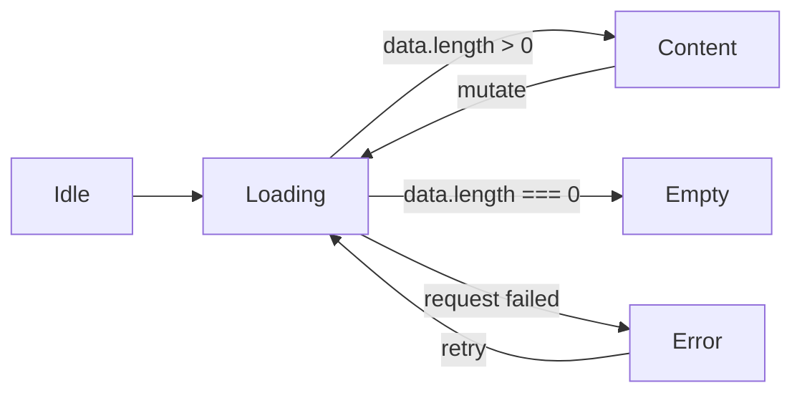

# UI Pattern Guidelines

Canonical patterns for the four cross-cutting UI states every data-driven screen needs:
**loading**, **error**, **empty**, and **form validation**. Each pattern names the **real
components** to reach for, the **design tokens** that should drive the styling, and points at
**actual examples in `web/app/**`**. Where the current code deviates from the token system,
that is called out as a [Follow-up](#follow-ups) rather than silently endorsed.

- **Components:** see [Component-Library](Component-Library.md).
- **Tokens:** reference by role/name from `base.json` / `globals.css`; never hard-code colors.
- **Icons:** `@tabler/icons-react` (see [Design-System-Grid](Design-System-Grid.md)).

## State lifecycle

Most list/detail screens move through the same states. Render exactly one at a time:


```mermaid
flowchart LR
  Idle --> Loading
  Loading -->|data.length > 0| Content
  Loading -->|data.length === 0| Empty
  Loading -->|request failed| Error
  Content -->|mutate| Loading
  Error -->|retry| Loading
```

The admin list pages already follow this: a single `isLoading` flag, then either the table
(content), the table's empty state, or a toast on failure — see
`web/app/(protected)/admin/users/page.tsx` and `web/components/admin/data-table.tsx`.

---

## Loading

**Goal:** Communicate that work is in progress without layout shift or false "empty" flashes.

### When to use what

| Situation | Pattern | Component |
|-----------|---------|-----------|
| Whole list/table loading | **Skeleton** rows in the table shape | `DataTable` (built-in `isLoading`) |
| In-button (submit in flight) | **`loading` prop** (spinner + disabled) or disable + label swap | `Button` (`loading`, or `disabled` + `"Saving…"`) |
| Content placeholders (preferred for known layouts) | **Skeleton** blocks | `Skeleton` (`@/components/ui/skeleton`) |

### Table loading (the shipped pattern)

`DataTable` renders **skeleton rows** in the table's shape when `isLoading` is `true`, so the
surrounding layout does not jump and the loading view matches the eventual content:

```tsx
// web/app/(protected)/admin/users/page.tsx
<DataTable columns={columns} data={users} rowActions={rowActions} isLoading={isLoading} />
```

```tsx
// web/components/admin/data-table.tsx (loading branch)
<tbody className="divide-y divide-border">
  {Array.from({ length: 5 }).map((_, i) => (
    <tr key={i}>{/* one <Skeleton className="h-4 w-3/4" /> per column */}</tr>
  ))}
</tbody>
```

The table chrome is token-driven (`bg-muted`, `text-muted-foreground`, `border-border`); the
skeleton fill uses `bg-muted` via the `Skeleton` component. An `sr-only` `role="status"` node
announces "Loading…".

### In-button loading

`Button` has a `loading` prop (spinner + `disabled` + `aria-busy`); the label-swap convention
also still works:

```tsx
<Button type="submit" loading={isSubmitting}>
  {isSubmitting ? "Saving…" : "Save Changes"}
</Button>
```

### Recommended: skeletons for structured content

For content with a known shape (cards, stat tiles, table rows), prefer **skeletons** over a
bare spinner — they preserve layout and feel faster. Use the `Skeleton` component
(`@/components/ui/skeleton`), token-driven (`bg-muted` + `animate-pulse`):

```tsx
import { Skeleton } from "@/components/ui/skeleton";
// Skeleton row placeholder (token-driven)
<Skeleton className="h-7 w-full" />
```

> [!NOTE]
> `Skeleton` lives at `web/components/ui/skeleton.tsx` and is adopted by `DataTable`'s loading
> state. Reach for it for any structured-content loading view.

**Tokens:** spinner accent → `primary` (or `accent`); skeleton fill → `muted`; helper text →
`muted-foreground`; container → `card`/`muted` + `border`.

---

## Error

**Goal:** Tell the user what failed and how to recover, at the right altitude.

### Three altitudes

| Altitude | Use when | Component | Tokens |
|----------|----------|-----------|--------|
| **Toast** (transient) | Result of a user action (save/delete/fetch failed) | `useToast().addToast(msg, "error")` + `ToastContainer` | `error` token |
| **Inline** (persistent, in-flow) | A specific section/region failed; user should see it until resolved | `Alert variant="destructive"` | `destructive`, `card` |
| **Field-level** | A single form field is invalid | `FormMessage` | `destructive` (see [Validation](#form-validation)) |
| **Page-level** | The whole route can't render (auth, fatal fetch) | full-bleed `Alert`/empty layout + retry, or a route error boundary | `destructive`, `muted-foreground` |

### Toast errors (the shipped pattern)

Every admin mutation funnels failures through a toast. The message is extracted from the API
response when available, then surfaced:

```tsx
// web/app/(protected)/admin/users/edit-modal.tsx
try {
  const response = await apiClient(`/api/users/${user.id}`, { method: "PATCH", body: … });
  if (!response.ok) {
    const errorData = await response.json().catch(() => ({}));
    throw new Error(errorData.error || errorData.message || "Failed to update user");
  }
  addToast("User updated successfully", "success");
  onSuccess();
} catch (error) {
  addToast(error instanceof Error ? error.message : "Failed to update user", "error");
}
```

**Conventions:**
- Always provide a human fallback message (`"Failed to update user"`); never surface a raw
  `[object Object]` or empty string.
- Parse `errorData.error || errorData.message` from the API envelope before falling back.
- Pair a failure toast with leaving the form open so the user can retry (the modal does this:
  it only calls `onSuccess()`/closes on success).

### Inline errors

For a persistent error tied to a region (e.g. a panel that failed to load, or a form-level
submission error that should stay visible), use a destructive `Alert` with a Tabler icon:

```tsx
import { Alert, AlertTitle, AlertDescription } from "@/components/ui/alert";
import { IconAlertCircle } from "@tabler/icons-react";
<Alert variant="destructive">
  <IconAlertCircle />
  <AlertTitle>Couldn't load roles</AlertTitle>
  <AlertDescription>Check your connection and try again.</AlertDescription>
</Alert>
```
Real destructive-message usage lives in the delete modals
(`web/app/(protected)/admin/{roles,tenants,ous}/delete-modal.tsx`), which surface a warning
icon (`IconAlertCircle` / `IconAlertTriangle`) before a destructive confirmation.

### Page-level errors

For a whole-route failure, render a centered message + a primary **retry** action (re-run the
fetch), mirroring the empty-state layout but with destructive emphasis. A Next.js route
`error.tsx` boundary is the idiomatic home for unrecoverable render errors.

> [!NOTE]
> Toast error styling uses the semantic `error` token (`bg-error`/`text-error-foreground`), and
> the container is a labeled `aria-live` region — see [Component-Library › Toast](Component-Library.md#toast-notifications).

---

## Empty

**Goal:** Make "no data yet" feel intentional, and give the user the next step.

### The shipped pattern

`DataTable` renders a centered icon + title (default "No data available") when
`sortedData.length === 0` (and not loading), in a sized container — so empty never looks broken.
Pass the optional `emptyState` prop (`{ icon?, title?, description?, action? }`) to enrich it
with a description and a create CTA:

```tsx
// web/components/admin/data-table.tsx (empty branch)
<div className="flex h-64 flex-col items-center justify-center gap-2 rounded-lg border border-border bg-muted/30 text-center">
  <IconDatabaseOff className="size-8 text-muted-foreground" />
  <p className="text-sm font-medium">No data available</p>
  {/* optional description + CTA via the `emptyState` prop */}
</div>
```

### Recommended empty-state anatomy

A good empty state has up to four parts. Keep it centered in the content container:

1. **Icon** — a relevant Tabler glyph (e.g. `IconUsers`, `IconInbox`) at `size-8`–`size-12`,
   `text-muted-foreground`.
2. **Title** — short, e.g. "No users yet".
3. **Description** — one line of `text-muted-foreground` explaining what will appear here.
4. **Primary CTA** — a `Button` that creates the first item (reuse the page's existing
   "Create …" action).

```tsx
import { Button } from "@/components/ui/button";
import { IconUsers, IconPlus } from "@tabler/icons-react";

<div className="flex h-64 flex-col items-center justify-center gap-2 rounded-lg border border-border bg-muted/30 text-center">
  <IconUsers className="size-8 text-muted-foreground" />
  <p className="text-sm font-medium">No users yet</p>
  <p className="text-xs text-muted-foreground">Create your first user to get started.</p>
  <Button className="mt-2 gap-2" onClick={openCreate}>
    <IconPlus size={16} /> Create User
  </Button>
</div>
```

**Distinguish empty from filtered-empty:** if a search/filter is active and yields nothing,
say "No results match your filters" and offer "Clear filters" instead of a create CTA.

**Tokens:** icon/description → `muted-foreground`; surface → `card`/`muted`; CTA → `primary`
(`Button` default).

> [!NOTE]
> The shipped `DataTable` empty state now uses the icon + title anatomy on token-driven chrome,
> and accepts an `emptyState` prop for an optional description + CTA. Distinguishing "no data"
> from "no filter results" is still per-page.

---

## Form validation

**Goal:** Validate with one schema, show errors at the field, and block invalid submits — all
accessibly. The app standardizes on **Zod schema + `react-hook-form` (`zodResolver`)** wired
through the `Form` components.

### The canonical pattern (verified in the real modals)

This is exactly how `web/app/(protected)/admin/users/create-modal.tsx` and
`.../users/edit-modal.tsx` work:

```tsx
"use client";
import { useForm } from "react-hook-form";
import { z } from "zod";
import { zodResolver } from "@hookform/resolvers/zod";
import { Form, FormField, FormItem, FormLabel, FormControl, FormMessage } from "@/components/ui/form";
import { Input } from "@/components/ui/input";
import { Button } from "@/components/ui/button";

// 1. Field-level rules live in one Zod schema (messages are the source of truth)
const createUserSchema = z.object({
  name: z.string().min(1, "Name is required"),
  email: z.string().email("Invalid email address"),
  password: z.string().min(8, "Password must be at least 8 characters"),
  role: z.string().min(1, "Role is required"),
  tenantId: z.string().min(1, "Tenant is required"),
});
type CreateUserFormData = z.infer<typeof createUserSchema>;

// 2. RHF owns form state; zodResolver runs the schema
const form = useForm<CreateUserFormData>({
  resolver: zodResolver(createUserSchema),
  defaultValues: { name: "", email: "", password: "", role: "", tenantId: "" },
});

// 3. onSubmit only runs when the schema passes
<Form {...form}>
  <form onSubmit={form.handleSubmit(onSubmit)} className="space-y-4">
    <FormField control={form.control} name="email" render={({ field }) => (
      <FormItem>
        <FormLabel>Email</FormLabel>
        <FormControl><Input type="email" placeholder="john@example.com" {...field} /></FormControl>
        <FormMessage />   {/* renders the Zod message in text-destructive when invalid */}
      </FormItem>
    )} />
    {/* … more fields … */}
    <Button type="submit" disabled={isSubmitting}>{isSubmitting ? "Creating…" : "Create User"}</Button>
  </form>
</Form>
```

### Field-level validation

- **One schema, one message source.** Each rule's message (e.g. `"Invalid email address"`) is
  authored in the Zod schema; `FormMessage` displays it. Don't duplicate messages in JSX.
- **Error styling is automatic and token-driven.** When a field errors, `FormControl` sets
  `aria-invalid` (so `Input`/`SelectTrigger` show the `destructive` ring), `FormLabel` turns
  `text-destructive`, and `FormMessage` renders in `text-destructive`.
- **Selects** validate the same way — wrap `SelectTrigger` in `FormControl` (see edit-modal).
- **Read-only fields** (e.g. email/name in edit-modal) use native `<label htmlFor>` + a
  disabled `Input`, and are intentionally excluded from the schema.

### Form-level validation & submission

- **Block invalid submits:** `form.handleSubmit(onSubmit)` only calls `onSubmit` after the
  schema passes, so no client guard is needed.
- **Server errors → toast** (form-level): on a non-OK response, throw with the API message and
  `addToast(msg, "error")`; keep the dialog open for retry. For an error that should persist
  in-form, render a destructive `Alert` above the footer instead of (or in addition to) a toast.
- **Submit button reflects state:** `disabled={isSubmitting}` + label swap (`"Creating…"`).
- **Confirm persistence when it matters:** the edit-modal re-reads the API response and asserts
  the persisted value matches what was sent before claiming success (WC-113) — a good pattern
  for mutations where silent no-ops are possible.

### Validation accessibility

The `Form` layer wires this for you (see [Component-Library › Form](Component-Library.md#form-react-hook-form--zod)):
`aria-invalid` on the control, `aria-describedby` linking the description + message ids, label
`htmlFor` matching, and `FormMessage` returning `null` when valid (no empty live nodes).

---

## Dates and times

**There is one way to put a date on a screen, and a CI guard enforces it.**

```tsx
import { useDateDisplay } from '@amroksaleh/features/datetime'

const { hidden, date, dateTime, age, relative, dateColumns } = useDateDisplay()
```

A tenant may set `ui.hide_dates` and be told that no date or time appears
anywhere in the interface. That promise is falsifiable by a single screen, and
the screen that leaks is by definition the one nobody checked — so
`scripts/ci-date-display-guard.php` fails the build on `toLocaleDateString`,
`toLocaleTimeString`, `Intl.DateTimeFormat`, a raw timestamp rendered as it
arrived, or a `?? rawValue` fallback around a formatter.

The hook also carries the reader's **resolved language**, which is why no call
site passes a locale any more. Eight of the twenty call sites of the helper it
replaced had forgotten to, and those screens quietly formatted in the browser's
locale — an Arabic reader on an `en-US` machine got `8/24/2026, 5:47 PM` inside
a right-to-left sentence.

### What to do when a date is hidden

Every formatter returns `null`, exactly as it does for an absent value. What you
do with that is a design decision, and it differs by surface:

| Surface | Do this | Not this |
|---|---|---|
| A table column that is only a date | `dateColumns()` — it returns `[]`, so header and cells go together | a column of em dashes under a header saying "Created" |
| A stat tile, a `<dt>/<dd>` pair, a whole record row | drop it: `...(hidden ? [] : […])` | a label with nothing beside it, which reads as a load that failed |
| A trail or history entry | keep the actor, drop the "when" — the rows are still in order | `— · by user 4` |
| A composed sentence | a **dateless variant** with its own key: `In {unit}` | `In {unit} since —` |
| A relative age ("3m ago") | hidden exactly as an absolute one is | vaguer phrasing as a middle ground — it is still a date |
| A date **input** | leave it alone | blanking a control somebody types into |

### The exceptions, and how to declare one

A value that genuinely is not a record timestamp carries a reasoned annotation.
An annotation with **no reason does not suppress anything** — the reason is the
whole mechanism.

```tsx
{/* @date-display-ignore: a time ZONE NAME ("Europe/Berlin"), not an instant. */}
{Intl.DateTimeFormat().resolvedOptions().timeZone}
```

The three that exist today are worth knowing, because they mark the boundaries:

- The **public document-verification page** (`/verify/[token]`) is governed by
  `documents.qr_public_detail`, not by `ui.hide_dates`. Its audience is a
  stranger holding a printed sheet, for whom the date is doing real verification
  work. A tenant that wants no date there chooses the `undated` level.
- **The stats Environment card** prints a time zone name.
- **A duration** is not a point in time. An outage's length on the status page
  stays; the moment it started does not.

### What is NOT affected

Nothing behind the screen. Every timestamp is still written, still indexed,
still queryable, still returned by every API endpoint, and still in the audit
trail — including the `From`/`To` filters on the audit log, which still query
the column whose display has just disappeared. Turning the setting off brings every
date back, because nothing was ever lost.

## Pattern quick reference

| Pattern | Reach for | Token roles | Real example |
|---------|-----------|-------------|--------------|
| Loading (list) | `DataTable isLoading` / skeletons | `primary`, `muted`, `muted-foreground` | `users/page.tsx` |
| Loading (action) | `Button disabled` + label | — | every modal `onSubmit` |
| Error (transient) | `useToast().addToast(_, "error")` | `error` | every admin mutation |
| Error (inline/page) | `Alert variant="destructive"` | `destructive`, `card` | delete modals |
| Empty | centered icon + title + desc + CTA | `muted-foreground`, `primary` | `DataTable` empty branch |
| Validation | Zod + RHF + `Form*` + `FormMessage` | `destructive`, `muted-foreground` | `users/create-modal.tsx` |

## Follow-ups

Resolved in WC-125:

1. ✅ **`DataTable` chrome → tokens** — loading/empty/table chrome now uses `muted`/`border`/
   `muted-foreground`/`foreground` (no raw palette).
2. ✅ **Empty state anatomy** — icon + title by default, with an optional `emptyState` prop for
   description + CTA. (Distinguishing "no data" from "no filter results" is still per-page.)
3. ✅ **Toast token-aligned + live region** — semantic `success`/`error`/`warning`/`info` tokens,
   `aria-live` region, labeled dismiss button.
4. ✅ **`Skeleton` component** — `web/components/ui/skeleton.tsx`, adopted by `DataTable` loading.
6. ✅ **Textarea `aria-invalid`** — destructive ring now applies on the error state.

Still open:

5. **No shared empty/error-state component.** Each page reimplements (or relies on `DataTable`).
   Consider a small `EmptyState` / `ErrorState` primitive for consistency.

## Related documentation

- [Component-Library](Component-Library.md) — full component specs & states
- [Design-System-Overview](Design-System-Overview.md) — architecture & principles
- [Theme-Customization](Theme-Customization.md) — tokens & white-label theming
- [Design-System-Grid](Design-System-Grid.md) — 8px grid, icon set, brand spacing
